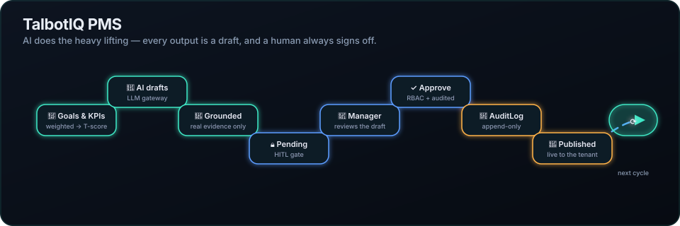

<p align="center">
  
</p>

<h1 align="center">TalbotIQ PMS</h1>

<p align="center">
  <strong>An AI-powered Performance Management System for the SME market.</strong><br>
  Multi-tenant · RBAC · human-in-the-loop AI · enterprise-grade.
</p>

<p align="center">
  
  
  
  
  
  
  
</p>

---

## What it is

TalbotIQ PMS runs the full performance cycle — **goals & KPIs, reviews, 360° feedback, approvals,
succession, JD generation, and career roadmaps** — with AI woven through every surface. The
difference from a bolt-on "AI feature" is the operating principle:

> **The AI proposes. A human always approves.**

Every AI output — a review draft, a 360 summary, a generated job description, a multi-step plan —
is produced from **real tenant data only** and lands in a `PENDING_HUMAN_REVIEW` state behind a
hard human-in-the-loop (HITL) gate. Nothing is published, and no write happens, without an explicit
human approval that is checked against RBAC and recorded in an append-only audit log.

## The core idea (the HITL loop)

The hero above is the whole product in one diagram:

```
Goals & KPIs  →  AI drafts (grounded)  →  PENDING (HITL gate)  →  Manager reviews
      ↑                                                                    │
   next cycle  ←  Published  ←  AuditLog (append-only)  ←  Approve (RBAC + audited)
```

The agentic chat follows the same rule: you ask for an outcome ("*start a 360 for Vera and draft
her review*"), the agent **plans** it into ordered steps with a grounded reason for each, and
**nothing executes until you approve each step**. The LLM only ever emits action *names* — every
parameter is resolved server-side within your scope.

## Quickstart

**Prerequisites:** Docker + Docker Compose.

```bash
git clone https://github.com/Hari-builds-ideas/pms-talbotiq.git
cd pms-talbotiq
cp .env.example .env          # fill in your own values; the real .env is git-ignored

docker compose up -d          # web, frontend, mysql, redis, celery worker/beat, flower
./scripts/demo_ready.sh       # migrate + seed rich demo data + end-to-end smoke → "✓ DEMO READY"
```

Then open **http://localhost:8080** and log in with a demo account below.

| Surface        | URL                     |
|----------------|-------------------------|
| App            | http://localhost:8080   |
| Flower (Celery)| http://localhost:5555   |
| MySQL          | localhost:3307          |
| Redis          | localhost:6380          |

> **AI is optional.** With no LLM key configured, every agent degrades honestly to a `503`/
> not-configured state and **never fabricates output**. To enable live AI, set `LLM_PROVIDER` +
> a key in `.env` (see [`docs/AI_GOLIVE.md`](docs/AI_GOLIVE.md)). For a zero-spend deterministic
> run, set `LLM_PROVIDER=apps.ai.providers.FakeLLMProvider`.

## Demo accounts

Seeded by `seed_demo_rich` on tenant **`acme`**. Password for all: **`Passw0rd!demo`**.

| Role      | Email               | Sees                                          |
|-----------|---------------------|-----------------------------------------------|
| Admin     | `admin@acme.test`   | Full tenant control                           |
| HRBP      | `priya@acme.test`   | Business-unit wide (JD Library, succession…)  |
| Manager   | `ada@acme.test`     | Own data + her team (the demo manager)        |
| Employee  | `akhil@acme.test`   | Own data only                                 |

A ready demo walkthrough (incl. the agentic-chat and JD-generation flows) lives in
[`DEMO_VIDEO_SCRIPT.md`](DEMO_VIDEO_SCRIPT.md).

## Feature tour

- **Goals & KPI engine** — weighted goals (sum to 100) → KPIs with recorded actuals → a
  cohort-relative T-score and risk band, computed by a deterministic scoring engine.
- **Reviews + HITL** — AI drafts a review grounded in the person's real goals/KPIs; it locks
  `PENDING_HUMAN_REVIEW` for the manager to edit and approve.
- **360° feedback** — summaries are built from an **anonymised** payload; a post-generation breach
  check holds anything that could re-identify a reviewer. Min-volume gate protects small cohorts.
- **Agentic chat** — plan → per-step approve → execute, with session memory and grounded reasons.
- **JD generator** — HR gives a one-line brief; AI writes a full JD → `PENDING_HUMAN_REVIEW` → approve to publish.
- **Succession, career roadmaps, approvals matrix, live org chart, analytics** — each grounded in
  real PMS data, name-free where anonymity matters, advisory where it must be.

Test-design for every AI feature (input/output contracts + pass/fail scoring) is in
[`AI_FEATURE_TEST_CASES.md`](AI_FEATURE_TEST_CASES.md).

## Architecture

**Non-negotiable rules** (enforced across the codebase):

1. Every model inherits `TenantScopedModel` (tenant-scoped, UUID pk); the manager filters every
   queryset by `tenant_id`.
2. JWT embeds `tenant_id` + role on every request; **RBAC is checked server-side on every endpoint**.
3. **Every AI output is saved `PENDING_HUMAN_REVIEW`** — the HITL gate is always on.
4. `AuditLog` is **append-only** (no UPDATE/DELETE).
5. **All LLM calls go through `LLMGateway`** — never a direct SDK call.

**Tech stack:** Python 3.11 · Django 4.2 · Django REST Framework · MySQL 8 · Redis 7 + Celery ·
LangGraph-style agent seams · a provider-agnostic LLM layer · React + TypeScript + Tailwind +
shadcn/ui · JWT (simplejwt) + OAuth + MFA · Argon2.

**Request → AI flow:** an agent calls `LLMGateway.run(...)`, which resolves the configured provider,
reserves the per-tenant budget, PII-scrubs the prompt, calls the model inside a trace span,
validates the structured output against the agent's schema, and returns a structured result — never
a raw exception. See [`docs/AGENT_ARCHITECTURE.md`](docs/AGENT_ARCHITECTURE.md) and
[`docs/SYSTEM_DESIGN_AND_READINESS.md`](docs/SYSTEM_DESIGN_AND_READINESS.md).

**Provider-agnostic AI:** the vendor lives behind one class, resolved from `settings.LLM_PROVIDER`.
Pointing at any OpenAI-compatible endpoint (incl. an internal engine) is a config change — base URL +
key + model map — with no code change. See [`docs/AI_GOLIVE.md`](docs/AI_GOLIVE.md).

## Repository layout

```
apps/            Django apps — the domain
  ai/            LLMGateway, agents, planner, providers, schemas   ← the AI layer
  goals/  reviews/  feedback/  approvals/  succession/  jd/  career/
  identity/  tenancy/  rbac/  billing/  core/  integrations/
config/          Django settings (base / prod / test) + Celery
frontend/        React + TypeScript + Tailwind + shadcn/ui SPA
shared/          Shared TS types + API client (web + mobile)
scripts/         demo_ready.sh (one-command demo), smoke.py (E2E)
docs/            Architecture, runbook, AI go-live, design, and archived build notes
```

## Testing

```bash
docker compose run --rm web pytest            # backend (pytest-django + factory_boy)
cd frontend && npx vitest run                 # frontend (vitest)
./scripts/demo_ready.sh                        # full end-to-end smoke against the live stack
```

CI-safe by default: tests pin `LLM_PROVIDER` off / use the deterministic `FakeLLMProvider`, so no
network or spend is required.

## Documentation

| Doc | What |
|-----|------|
| [HANDOVER.md](HANDOVER.md) | Start here if you're new — run it, branch state, gotchas |
| [DECISIONS.md](DECISIONS.md) | Architecture & product decisions |
| [docs/AGENT_ARCHITECTURE.md](docs/AGENT_ARCHITECTURE.md) | How the AI agents + gateway work |
| [docs/SYSTEM_DESIGN_AND_READINESS.md](docs/SYSTEM_DESIGN_AND_READINESS.md) | System design + prod readiness |
| [docs/AI_GOLIVE.md](docs/AI_GOLIVE.md) | Taking the AI layer to production |
| [docs/RUNBOOK.md](docs/RUNBOOK.md) · [docs/OBSERVABILITY.md](docs/OBSERVABILITY.md) | Ops |
| [AI_FEATURE_TEST_CASES.md](AI_FEATURE_TEST_CASES.md) | Model-quality validation pack |
| [docs/archive/](docs/archive/) | Dated build notes & working history |

## Status

Feature-complete through the July handoff. Backend + web test suites green; a live end-to-end smoke
(`demo_ready.sh`) gates the demo. Known caveats and the branch model are documented in
[HANDOVER.md](HANDOVER.md).

---

<p align="center"><sub>Private repository · Talbotiq · the animated hero renders static on GitHub — open <code>docs/assets/hero.svg</code> directly to see it animate.</sub></p>
