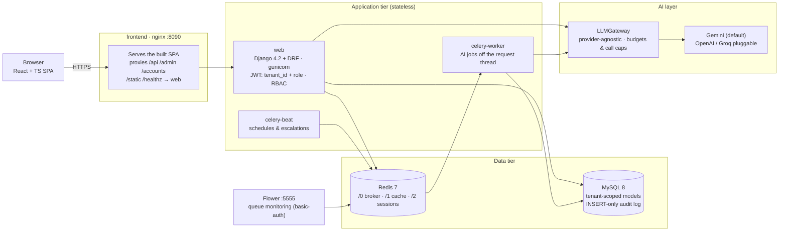
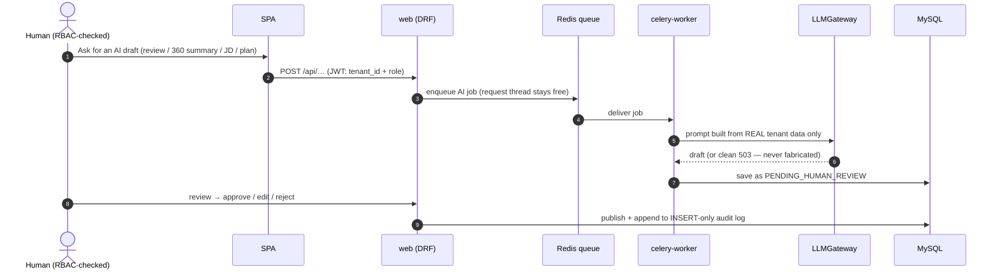

<h1 align="center">Axiom</h1>

<p align="center">
  <strong>A multi-tenant, AI-assisted Performance Management System for SMEs.</strong><br>
  Goals &amp; OKRs · Reviews · 360° Feedback · Check-ins · Recognition · Org Chart · JD Generator · Analytics
</p>

<p align="center">
  
  
  
  
  
  
</p>

---

## What Axiom is

Axiom runs the full performance cycle for a company — **goals/OKRs, reviews, 360°
feedback, weekly check-ins, recognition, a live org chart, an AI JD generator, and
analytics** — with AI woven through every surface under one operating rule:

> **The AI proposes. A human always approves.**

Every AI output (a review draft, a 360 summary, a generated JD, a multi-step plan)
is produced from **real tenant data only**, lands in a `PENDING_HUMAN_REVIEW` state
behind a hard human-in-the-loop (HITL) gate, is checked against RBAC, and is recorded
in an append-only audit log. Each customer is an isolated **tenant**.

## Tech stack

| Layer | Choice |
|---|---|
| Backend | **Python 3.11 · Django 4.2 · Django REST Framework** (gunicorn/WSGI) |
| Database | **MySQL 8** (multi-tenant, `utf8mb4`, strict mode) |
| Async / queue | **Redis 7 + Celery** — heavy AI runs off the request thread |
| Frontend | **React + TypeScript + Tailwind + shadcn/ui** (SPA served by nginx) |
| AI | **Provider-agnostic LLM gateway** (defaults to **Google Gemini**; OpenAI/Groq pluggable) |
| Auth | JWT (simplejwt) + OAuth/OIDC (allauth) + SAML 2.0 + MFA (TOTP); Argon2 passwords |

## Quickstart (local demo)

```bash
# 1. Bring the stack up (web + celery worker/beat + MySQL + Redis + frontend).
#    Migrations run AUTOMATICALLY when web starts — do not run migrate manually.
docker compose up -d

# 2. Watch web apply migrations and boot gunicorn (Ctrl-C when it's serving).
docker compose logs -f web

# 3. Seed the rich demo tenant (~210 people across every module; idempotent).
docker compose exec web python manage.py seed_demo_rich

# 4. Open the app.
open http://localhost:8090
```

> **Do not run `migrate` / `deploy_migrate` alongside `docker compose up`.** The
> `web` container runs `migrate --noinput` itself on every start; a second, parallel
> migrate races it (typical symptom: `Duplicate column name …`). `deploy_migrate`
> (advisory-locked) is for **production** deploys, where the web tier does not
> auto-migrate.

> **First boot on a fresh volume:** MySQL initializes itself on its very first start
> and can report *Healthy* (local socket) a few seconds before it accepts network
> connections. If `web` exits with `Can't connect to server on 'mysql'`, just wait
> ~30–60 s and run `docker compose up -d` again — nothing is broken.

**Demo accounts** — tenant **`acme`**, password **`Passw0rd!demo`**:

| Login | Role | Sees |
|---|---|---|
| `admin@acme.test` | ADMIN | whole tenant |
| `priya@acme.test` | HRBP | business unit |
| `ada@acme.test` | MANAGER | own + team |
| `akhil@acme.test` | EMPLOYEE | own data |

One-command full check: `./scripts/qa_handover.sh` (reseeds, seeds the `globex`
cross-tenant fixture, runs 131 API checks). Backend tests: `docker compose exec web pytest`.

## Run it in GitHub Codespaces

The default Codespaces image has everything needed (Docker, Compose) — no setup.

1. **Create a codespace** — repo page → **Code ▾ → Codespaces → Create codespace on main**.
2. **Start the stack** (first run builds the images, ~4 min):
   ```bash
   docker compose up -d
   docker compose logs -f web     # wait for migrations + "Booting worker" — Ctrl-C after
   ```
   On the very first boot MySQL initializes a fresh volume — if `web` exits with
   `Can't connect to server on 'mysql'`, wait ~30–60 s and `docker compose up -d` again.
   **Don't run migrations manually** — `web` migrates itself (see the note above).
3. **Seed the demo data**:
   ```bash
   docker compose exec web python manage.py seed_demo_rich
   ```
4. **Open the app** — Codespaces forwards ports automatically: open the **Ports** tab
   and follow the forwarded URL for port **8090** (the SPA + API edge). Port 5555 is
   Flower (Celery monitoring, basic-auth).
5. Log in with the demo accounts above (tenant `acme`, password `Passw0rd!demo`).

## Key features

- **Goals & OKRs** — weighted goals + KPIs, cycle scoring, progress timelines.
- **Reviews** — HITL state machine (draft → pending → approved → finalized), AI drafts.
- **360° Feedback** — anonymized, request/response cycles, AI summaries.
- **Check-ins & Recognition** — weekly notes + a kudos feed.
- **Org chart, JD generator, Analytics** — live reporting tree, AI JDs, cohort analytics.
- **Onboarding** — self-serve tenant signup, CSV bulk employee import, invitations.
- **Billing** — plans + a payment gate (Stripe + Razorpay, **test mode**).
- **AI assistant** — a propose-confirm agent that only ever executes registered,
  RBAC-checked, human-approved actions.

## Architecture



Every AI feature follows the same **human-in-the-loop** path — the AI can only ever
*propose*; a human approves before anything is published or executed:



## Architecture principles (non-negotiable)

- **Tenant isolation** — every model is tenant-scoped with a fail-closed manager; a
  cross-tenant id returns 404, never a leak. JWTs embed `tenant_id` + role.
- **Server-side RBAC** — enforced on every endpoint (4 roles: Employee < Manager <
  HRBP < Admin). The SPA never gates; the server is the sole authority.
- **HITL on all AI** — every AI output is saved `PENDING_HUMAN_REVIEW`; nothing is
  published or written without explicit human approval. AI never fabricates on failure.
- **INSERT-only audit log** — consequential actions are recorded immutably (no update,
  no delete at the DB level).
- **AI off the request thread** — heavy AI runs in **Celery** (Redis broker), so a
  slow/failing model call can never block or crash the web tier under load.

## Documentation

| Doc | For |
|---|---|
| [`docs/DEPLOYMENT_GUIDE.md`](docs/DEPLOYMENT_GUIDE.md) | Deployment team — services, every env var, step-by-step deploy, troubleshooting |
| [`docs/TESTING_GUIDE.md`](docs/TESTING_GUIDE.md) | Testing team — demo accounts, what to test, what's covered, bug-report format |
| [`docs/SECURITY_TESTING_HANDOVER.md`](docs/SECURITY_TESTING_HANDOVER.md) | Security testers — surfaces worth attention, staged items |
| [`docs/DATA_CLEANUP.md`](docs/DATA_CLEANUP.md) | Demo-data hygiene + per-module verification |
| [`docs/DATA_HANDOVER.md`](docs/DATA_HANDOVER.md) | Mock vs real data; clean empty prod vs demo seed |
| [`docs/PROD_READY_REPORT.md`](docs/PROD_READY_REPORT.md) | Production-readiness summary + morning checklist |
| [`docs/AI_ROBUSTNESS.md`](docs/AI_ROBUSTNESS.md) · [`docs/SSO.md`](docs/SSO.md) · [`docs/RUNBOOK.md`](docs/RUNBOOK.md) | AI under load · SSO · ops runbook |

**Operating the production deployment** — start here, these are the current ones:

| Doc | For |
|---|---|
| [`docs/BUILD/ENABLE_TLS.md`](docs/BUILD/ENABLE_TLS.md) | Switching HTTPS on. One variable, once DNS exists |
| [`docs/BUILD/BACKUP_RESTORE.md`](docs/BUILD/BACKUP_RESTORE.md) | Nightly backups, the restore drill, and restoring for real |
| [`docs/BUILD/EMAIL.md`](docs/BUILD/EMAIL.md) | Going live with SMTP — exact values per provider |
| [`docs/BUILD/DATA_RETENTION.md`](docs/BUILD/DATA_RETENTION.md) | What is stored, why, and for how long |
| [`docs/BUILD/DATA_RIGHTS_DESIGN.md`](docs/BUILD/DATA_RIGHTS_DESIGN.md) | Export and erasure semantics |
| [`docs/BUILD/CI.md`](docs/BUILD/CI.md) · [`docs/BUILD/ENV_REFERENCE.md`](docs/BUILD/ENV_REFERENCE.md) | CI and branch protection · every environment variable |
| [`docs/BUILD/PROGRESS.md`](docs/BUILD/PROGRESS.md) | Why each piece of the hardening work looks the way it does |
| [`CONTRIBUTING.md`](CONTRIBUTING.md) · [`SECURITY.md`](SECURITY.md) | Working on this codebase · reporting a vulnerability |

[`docs/archive/`](docs/archive/README.md) holds superseded plans and build-session
notes. It is history, not instructions — if it contradicts anything above, the
document above is right.

## Data: production starts empty

A fresh production deploy comes up with an **empty database** — migrations only, **no
mock data auto-loads**. `seed_demo_rich` is for testing/demo **only** and is never run
in production. Real data enters via invitation + CSV import. Details in
[`docs/DATA_HANDOVER.md`](docs/DATA_HANDOVER.md).

Once there is real data in it, it is backed up nightly to GCS and the backup is
restored into a scratch database every week to prove it still works — neither of
which happens until the timers in `deploy/systemd/` are installed. See
[`docs/BUILD/BACKUP_RESTORE.md`](docs/BUILD/BACKUP_RESTORE.md).

## Not yet live (honest status)

Each of these is built up to the point where it needs a credential, a DNS record
or a decision that is not ours to make. None of them is half-finished code.

- **HTTPS is off.** There is no domain yet, and Let's Encrypt cannot issue a
  certificate for a bare IP, so the deployment serves plain HTTP. `DOMAIN` is the
  single switch that turns on the certificate, the redirect, Secure cookies and
  HSTS together; `check --deploy` reports `pms.W003` until it is set. Steps:
  [`docs/BUILD/ENABLE_TLS.md`](docs/BUILD/ENABLE_TLS.md).
- **Email does not send.** The console backend is active, so password resets and
  invitations are written to the log and delivered to nobody. Going live is
  environment variables only: [`docs/BUILD/EMAIL.md`](docs/BUILD/EMAIL.md).
- **Payments cannot take money.** `create_checkout` returns 501 rather than a
  fabricated session id — the webhook side is real and signature-verified, but
  nothing charges a card. Wiring a provider SDK is a supervised step.
- **Self-serve signup is closed** (`SIGNUP_MODE=invite_only`) precisely because
  of the line above: a new workspace today would be a real tenant on a plan no
  invoice can follow. Invitations are unaffected — existing customers onboard
  their own people normally.
- **AI needs a key.** Without one the gateway reports *not configured* and every
  AI surface says so; it never fabricates. The Gemini Enterprise key is added by
  an admin, per tenant, and is stored encrypted.
- **Sign-in with Google / enterprise SSO** is wired (allauth OIDC + SAML, no JIT
  provisioning) but needs the customer's real credentials or IdP to exercise end
  to end.
- **Mobile app** is deferred to v2 — the web app is responsive.

## Configuration

All configuration is via environment variables — see **`.env.example`** for the full
list with comments. Never commit a filled `.env` (it is gitignored); production
injects secrets via the platform secret store.
