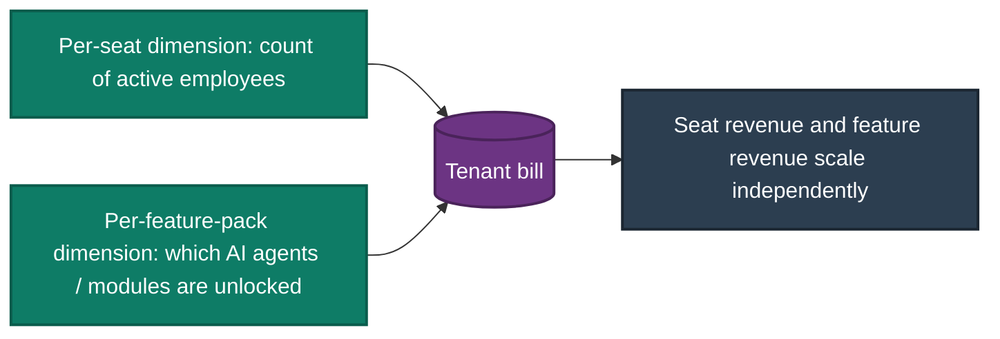
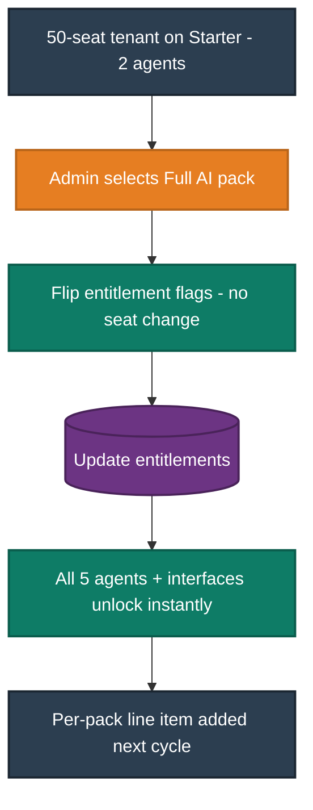
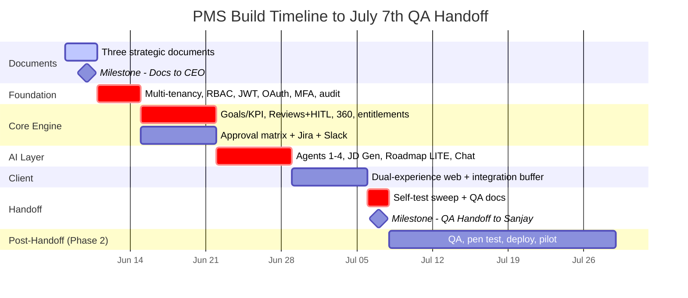

# Document 1 — Strategy & Project Plan

**Product:** AI-Powered Performance Management System (PMS)
**Company:** Talbotiq · **Bucket Owner / Developer:** Hari K
**Status:** Draft for CEO and leadership review · **Scope marker:** ✅ MVP (July 7th handoff) · ⚠️ Phase 2
**Purpose:** This is the executive strategy and delivery plan. It is kept deliberately separate from the feature detail (Document 2) and the AI catalogue (Document 3), per the CEO's instruction, and reads as the "why, who, when, and how we measure success."

---

## 1. Executive Summary

The PMS is an AI-driven performance management platform built for the full market spectrum — from a fifty-seat restaurant to a ten-thousand-seat corporation — on a single multi-tenant codebase. It replaces manual, spreadsheet-driven appraisals with a continuous system that collects performance signals (goals, KPIs, 360° feedback) and uses AI to do the heavy synthesis: drafting reviews, flagging at-risk performers, planning succession, generating job descriptions, and surfacing career roadmaps. Every consequential AI output shows its reasoning and waits for human approval before it becomes real.

The commercial model is two independent dimensions — a per-seat charge and per-feature-pack entitlements — so AI capability is sold and upgraded without touching headcount. The product is positioned not as another tool, but as an assistant that does the administrative work so people spend their time on decisions.

Delivery is structured around a single near-term milestone: a fully built, self-tested MVP handed to the QA team on **July 7th**. That date is an internal handoff, not a public go-live — but the platform is being engineered to production-grade, public-live standards from the first commit, so that what QA receives is robust enough to be a finished product, not a prototype.

---

## 2. Product Vision

A performance management platform should remove work, not add it. Today most systems do the opposite: they digitise the paperwork without reducing the burden, demand IT expertise that smaller companies do not have, and treat AI as a bolt-on novelty.

Our vision is the inverse — **technology that simplifies technology**. The platform is self-serviceable by design: a small-business owner can ask, in plain language, "how is my team doing this month?" and get an answer, while an enterprise HR function gets full calibration, succession, and analytics on the same foundation. AI is the headline of the product, not an accessory, and it is trustworthy because every consequential action is transparent and human-approved.

The single sentence that captures the pitch: **AI that does the work and shows its reasoning.**

---

## 3. The Problem We Solve

The platform is built around the specific pains that keep small and mid-sized businesses from adopting performance and automation systems. Each is a deliberate design driver.

| Pain | What it means for the customer | How the PMS answers it |
|---|---|---|
| **A — Complex / complicated** | Hard to start, onboard, and use | Guided setup, pre-built KPI templates by role, conversational assistant as a primary interface |
| **B — Inaccessible / too expensive** | Automation seen as cost-prohibitive for smaller firms | Per-seat pricing from roughly $5–$15 for micro tenants; pay only for the feature packs used |
| **C — No in-house IT talent** | Cannot configure or maintain enterprise systems | Self-service defaults, sensible templates, minimal administration |
| **D — Fragmented systems** | Tools work in isolation | One platform; integrations with Jira and Slack; a unified data model |
| **E — Unorganised data** | Need digitalisation before AI is useful | The platform generates its own structured performance data as people use it |
| **F — Reactive, not proactive** | Problems surface too late | Fast-AI nudges flag at-risk KPIs before a cycle ends |
| **G — Security concerns** | Uncertainty about data safety | Tenant isolation, encryption in transit and at rest, MFA, immutable audit |
| **H — Uncertain ROI** | Unclear what benefit to expect | Measurable outcomes: time saved per review, cycle-time reduction, adoption metrics |
| **I — Fear of replacement** | Worry that automation displaces people | Positioned as assistance: AI drafts and recommends; humans decide. Nothing consequential is automated end-to-end |

---

## 4. Target Users

Four roles, scoped to the organisation tree, define who uses the system and why they care.

| Role | What they do in the platform | Why they care |
|---|---|---|
| **Employee** | View own goals, KPIs, feedback, and AI career roadmap; submit self-evaluation | Clarity on where they stand and how to grow |
| **Manager** | Set and approve goals for reports, run AI review drafts, approve reviews, view team analytics | Hours of review writing reduced to editing; early warning on at-risk reports |
| **HRBP** | Business-unit analytics, calibration, succession, JD library, audit access | A defensible, data-backed view of the whole population |
| **Admin** | Tenant configuration, users and roles, billing and feature entitlements | Control of cost, access, and what the tenant has unlocked |

---

## 5. Target Market & Pricing Strategy

The platform serves the full market on one codebase. The same deployment runs a five-seat tenant and a ten-thousand-seat tenant, isolated by tenant, tuned by configuration rather than by forking the product.

### 5.1 The four tiers

| Tier | Employees | Pricing & strategy |
|---|---|---|
| **Micro / Starter** | 0 – 50 | Base price of roughly **$5–$15 per employee / month**. Must remain highly useful for small setups such as restaurants. Ships with the 2-agent starter pack and pre-built role templates. |
| **Mid-Sized (SME)** | 51 – 250 | Standard per-seat commercialised pricing. Full agent suite available as packs. |
| **Large Enterprise** | 251 – 1,000 | Scaled enterprise per-employee pricing. Full feature set, SSO, advanced analytics. |
| **Very Large** | 1,000+ | Highest tier for massive corporate deployments; custom commercial terms and dedicated infrastructure. |

Implementation principle: the tier is only a label. The system enforces nothing on "tier" — it enforces **seat count × feature entitlements**. New packs or promotional bundles are a configuration and billing exercise, never a code change.

### 5.2 Two decoupled commercial dimensions

Pricing is commercialised on two independent axes, so seat revenue and feature revenue move separately.



### 5.3 The AI upgrade path (decoupled from headcount)

Because seats and entitlements are separate, buying more AI never requires changing headcount. A 50-person company on the Starter pack with 2 AI agents can move to all 5 AI features by purchasing the "Full AI" pack — the seat count is untouched, the previously locked agents and their interfaces appear instantly, and billing adds the per-pack line item on the next cycle. No re-contracting, no migration.



---

## 6. Objectives & Success Metrics

Success is defined at two horizons: what makes the **July 7th handoff** a pass, and what makes the **product commercially successful** once live. The handoff criteria are deliberately stringent — they are the production-grade bar described in §8.

### 6.1 MVP handoff acceptance criteria (the July 7th bar)

| Objective | Measurable criterion |
|---|---|
| Tenant isolation | Zero cross-tenant leakage; a cross-tenant probe returns nothing in both directions |
| Access control | RBAC enforced server-side on every endpoint; a manager is blocked (403) from a peer's record |
| AI trust | No Large-AI output can finalise without human approval; PII scrubbed before any model call |
| Auditability | Immutable audit log verified at the database level (insert and read only) |
| Security | TLS 1.2+ in transit, AES-256 at rest, MFA available, OWASP Top 10 checks pass |
| Accessibility | Desktop Admin Hub meets WCAG 2.1 Level AA |
| Quality | Full self-test battery executed and documented; signed pre-handoff checklist delivered |
| Usability | User manual requiring under two hours of training, plus technical and API documentation |

### 6.2 Commercial success metrics (post-launch horizon)

| Metric | Why it matters |
|---|---|
| Activation / adoption rate | Proves the product is genuinely usable, especially for smaller tenants |
| Time saved per review cycle | Direct evidence of the "AI does the work" value |
| AI draft acceptance rate | Whether managers trust and keep AI output |
| Cycle completion time | Operational efficiency of the appraisal process |
| Employee engagement (eNPS) | Whether the experience is positive, not burdensome |
| Starter-to-Full-AI upgrade conversion | Validates the decoupled AI upgrade path commercially |
| p95 latency and uptime | Production reliability once live |

---

## 7. Solution Positioning

Three positions hold the strategy together and should anchor any external pitch.

First, **AI-driven, not AI-flavoured.** The five orchestrated agents and the Fast-AI assistant are the product's commercial moat, not a feature checkbox. The market sees an assistant that is always present and a set of deeper agents that do real analytical work.

Second, **trust as a feature.** Every consequential AI output carries a visible confidence indicator and passes through a human approval gate before it takes effect, and every such action is written to an immutable audit trail. This is simultaneously a compliance posture and a marketing position — it directly answers the customer's fear of being replaced and their concern about ceding judgement to a machine.

Third, **one platform, two experiences.** A desktop Admin Hub handles complex HR operations; a streamlined, mobile-responsive Engagement Hub handles the on-the-go actions — continuous feedback, 1:1 notes, goal tracking, quick assessments, one-click approvals. Both are the same web platform consuming the same API, which keeps adoption high without doubling the build.

A high-level view of the system in its environment (full architecture is in Document 2, §4):

```structurizr
workspace "PMS Context" "PMS - System Context for Strategy" {
    !identifiers hierarchical

    model {
        employee = person "Employee" "Tracks goals, gives feedback, views roadmap."
        manager  = person "Manager" "Drafts and approves reviews, manages reports."
        hrbp     = person "HRBP" "Calibration, succession, analytics, JD library."
        admin    = person "Admin" "Tenant, users, roles, billing and entitlements."

        pms = softwareSystem "PMS Platform" "AI-driven, multi-tenant performance management for all company sizes."

        llm   = softwareSystem "LLM Providers" "Third-party (Claude / GPT) and home-grown MLM." "External"
        idp   = softwareSystem "Identity Provider" "OAuth / SSO; SAML in Phase 2." "External"
        jira  = softwareSystem "Jira" "Source of KPI actuals." "External"
        slack = softwareSystem "Slack" "Notifications and feedback prompts." "External"

        employee -> pms "Uses"
        manager  -> pms "Uses"
        hrbp     -> pms "Uses"
        admin    -> pms "Administers"
        pms -> llm "Server-side, PII-scrubbed inference"
        pms -> idp "Authenticates users"
        pms -> jira "Pulls KPI actuals"
        pms -> slack "Sends notifications"
    }

    views {
        systemContext pms "Context" {
            include *
            autolayout lr
        }

        styles {
            element "Element" {
                shape roundedbox
                color #FFFFFF
            }
            element "Person" {
                shape person
                background #2C3E50
                color #FFFFFF
            }
            element "Software System" {
                background #1B4F72
                color #FFFFFF
            }
            element "External" {
                background #566573
                color #FFFFFF
            }
            element "Boundary" {
                strokeWidth 5
            }
            relationship "Relationship" {
                thickness 4
                color #34495E
            }
        }
    }

    configuration {
        scope softwaresystem
    }
}
```

---

## 8. The July 7th Handoff and Production-Grade Rigor

July 7th is the date the platform is handed to the QA team (Sanjay's team) for independent verification. It is an internal milestone, not a public launch. This distinction matters for *sequencing* — third-party penetration testing, the production deployment, and pilot onboarding sit after this date — but it must not soften the engineering standard.

The platform is built to be **as robust as a finished, public-live product** from the outset. Concretely, this means the following are non-negotiable inside the build window, not deferred to "later hardening":

- **Architecture:** multi-tenant isolation enforced at the data-access layer on every query; nothing relies on UI-level restriction.
- **Security:** encryption in transit (TLS 1.2+) and at rest (AES-256), MFA capability, and protection against the OWASP Top 10 designed in, not bolted on.
- **AI governance:** the human-in-the-loop gate and the immutable audit trail are present on day one and are the last things ever to be cut under schedule pressure.
- **Documentation:** the QA strategy, test cases, and a signed pre-handoff checklist are produced incrementally throughout the build so the handoff is a verification exercise for QA, not a discovery exercise.

What the developer hands over is therefore a tested, documented, signed-off system — QA validates quality rather than uncovering it.

---

## 9. Development Phases & Roadmap

The build is a disciplined, aggressive compression handled by a single engineer working at maximum output. The plan front-loads the elements that protect the product — isolation, access control, the AI trust gate — and reserves the final week as deliberate integration buffer.

### 9.1 Phases

| Phase | Window | Focus | Status |
|---|---|---|---|
| Strategic documents | Jun 8 – Jun 10 | The three foundational documents agreed with leadership | ✅ MVP |
| Foundation | Jun 11 – Jun 14 | Multi-tenancy, RBAC, JWT, OAuth, MFA, org tree, audit, LLM gateway, CI | ✅ MVP |
| Core engine | Jun 15 – Jun 21 | Goals/KPI + scoring, reviews + HITL, 360° feedback, entitlements, approval matrix, Jira and Slack | ✅ MVP |
| AI layer | Jun 22 – Jun 28 | Agents 1–4, JD Generator, Career Roadmap LITE, read-only chat — all HITL-gated and audited | ✅ MVP |
| Client (dual-experience web) | Jun 29 – Jul 5 | Desktop Admin Hub + responsive mobile-web Engagement Hub; integration buffer | ✅ MVP |
| Self-test sweep & handoff | Jul 6 – Jul 7 | Security/performance/integration sweep, QA documentation, signed pre-handoff checklist | ✅ MVP |
| QA, hardening & launch | Post Jul 7 | Independent QA, third-party penetration test, deployment, pilot onboarding | ⚠️ Phase 2 |
| Phase 2 capabilities | Post-launch | Native mobile app, Org Network Analysis, live compensation benchmarking, SAML, historical import | ⚠️ Phase 2 |

### 9.2 Timeline



### 9.3 Product lifecycle (handoff in context)

```mermaid
flowchart LR
    classDef autoNode fill:#0E7C66,stroke:#0A5C4C,stroke-width:2px,color:#FFFFFF;
    classDef humanNode fill:#E67E22,stroke:#B9651A,stroke-width:2px,color:#FFFFFF;
    classDef termNode fill:#2C3E50,stroke:#1B2631,stroke-width:2px,color:#FFFFFF;

    A["Build MVP - production-grade rigor"]:::autoNode --> B["Developer self-test battery"]:::autoNode
    B --> C["Signed pre-handoff checklist"]:::humanNode
    C --> D["July 7th QA handoff"]:::termNode
    D --> E["Independent QA - Sanjay's team"]:::humanNode
    E --> F["Hardening + third-party pen test"]:::autoNode
    F --> G["Production deploy + pilot onboarding"]:::termNode
    G --> H["Phase 2 capabilities"]:::autoNode
```



---

## 10. Risk Register

Risks are stated honestly, with the mitigation already designed into the plan.

| Risk | Why it matters | Mitigation |
|---|---|---|
| Single engineer compressing a large scope into roughly four weeks | Every addition compounds for one person | Front-load the foundation; hard scope line at the MVP/Phase 2 boundary; Week 4 reserved as buffer |
| Dense AI week (four agents plus JD, roadmap, chat) | The most concentrated week of the build | Build by value order — Review Assistant, KPI Intelligence, Successor Planning first; chat and roadmap LITE are the first to slide into the buffer if needed, never the safety gates |
| Enterprise LLM key provisioning lead time | Could block the AI layer | Provider-agnostic gateway with a standard-key plus PII-scrubbing fallback so the AI layer is never blocked; flagged as a launch caveat only |
| Approval-matrix complexity | Sequential and parallel routing is its own subsystem | Built within the core-engine week; parallel routing trails sequential if the week runs hot |
| Accessibility (WCAG 2.1 AA) | Cheap if designed in, costly if retrofitted | Built into the component library from the first screen |
| Scope creep | The single highest-probability threat to the date | Anything not in the agreed documents goes to a Phase 2 backlog, never into a build week |

---

## 11. Governance, Security & Compliance

The platform carries its compliance posture as a first-class part of the product, not an afterthought.

Access is governed by role-based access control scoped to the organisation tree and enforced server-side on every endpoint; the conversational assistant inherits the caller's exact permissions and can never reveal data the user could not already see. Data is isolated per tenant at the query layer, encrypted in transit (TLS 1.2+) and at rest (AES-256), with multi-factor authentication available and protection against the OWASP Top 10 designed in. Every consequential AI output is locked pending human review and is written to an immutable audit log before it can take effect. Aggregate analytics enforce a minimum-cohort rule so small teams cannot be de-anonymised. The desktop experience meets WCAG 2.1 Level AA. Third-party penetration testing is conducted after handoff as part of the QA and hardening phase.

---

## 12. Scope Summary — MVP vs Phase 2

The detailed feature and AI catalogues are in Documents 2 and 3. At a strategic level:

**✅ In the MVP (July 7th handoff):** multi-tenancy, RBAC, JWT, OAuth, MFA; goals/KPI and scoring; reviews with the human-in-the-loop gate and immutable audit; 360°, continuous, and 1:1 feedback; the configurable approval matrix (sequential and parallel); the AI JD Generator; the Live Org Chart; AI Agents 1–4 plus Career Roadmap LITE and read-only chat; Successor Planning on internal data; the dual-experience responsive web client; per-seat and per-feature entitlements with the demoable AI upgrade switch; the full self-test battery and documentation.

**⚠️ Phase 2 (post-handoff), each for a defensible reason:** SAML SSO (OAuth covers the MVP; SAML is per-enterprise vendor configuration); the native mobile application (the brief specifies responsive web for the MVP; native is a future channel); Organizational Network Analysis (influence scores are meaningless until feedback density accrues from live use); live compensation benchmarking and the associated salary and promotion recommendations (these depend on a licensed external salary feed — a procurement decision, not an engineering one); historical data import from Workday or SAP (a migration convenience; the engine already runs on internally generated data); and live payment capture (PCI vendor setup; the entitlement logic is fully demoable without it).

---

*End of Document 1. This strategy plan is the executive companion to Document 2 (Feature, Workflow & Module Specification) and Document 3 (AI Features — Fast vs Large). Diagrams use the colour system shared across all three documents.*
