# Document 2 — Feature, Workflow & Module Specification

**Product:** AI-Powered Performance Management System (PMS)
**Company:** Talbotiq · **Bucket Owner / Developer:** Hari K
**Status:** Draft for CEO review · **Scope marker:** ✅ MVP (July 7th handoff) · ⚠️ Phase 2
**Purpose of this document:** This is the build contract. Development is driven from here. The structure below is intended to become the **company-wide template** circulated to all other buckets.

---

## 0. How to read this document

Every module follows the agreed structure:

> **Module → Sub-module → Workflow → Core Features (Non-AI) → AI Features (Fast) → AI Features (Large)**

Each module section contains: a feature table in that structure, the screens/pages, the roles & permissions, integrations, dependencies, a **C4 architecture view**, and a **Mermaid workflow diagram**.

### Diagram formats used

| Format | Used for | How to render |
|---|---|---|
| **C4 Model (Structurizr DSL)** | System context, containers, and per-module components | Paste the single master workspace (§4) into [structurizr.com](https://structurizr.com) or Structurizr Lite, then export **each view** as its own image. One workspace → many diagrams. |
| **Mermaid flowchart** | Workflows, AI agent flows, state machines, approval routing, user journeys | Paste each block into the Mermaid Live Editor or any Mermaid renderer. Each block is self-contained. |

### Colour legend (applied consistently across the whole document)

**C4 (Structurizr) elements**

| Element | Colour | Shape |
|---|---|---|
| Person (actor) | Dark navy `#2C3E50` | Person |
| PMS software system / internal container | Blue `#1B4F72` / `#2471A3` | Rounded box |
| AI / agent container or component | Teal `#0E7C66` | Rounded box |
| Database / cache | Purple `#6C3483` | Cylinder |
| External system | Slate grey `#566573` | Rounded box |
| Boundary | — | Stroke width 5 |

**Mermaid nodes**

| Class | Meaning | Colour |
|---|---|---|
| `autoNode` | Automated / system / AI step | Teal `#0E7C66` |
| `humanNode` | **Human decision / approval (HITL)** | Orange `#E67E22` |
| `dataNode` | Datastore / persistence | Purple `#6C3483` |
| `termNode` | Start / end terminal | Navy `#2C3E50` |
| `errNode` | Error / reject path | Red `#C0392B` |
| `extNode` | External system call | Slate `#566573` |

> **The single most important visual rule:** teal = the machine acted; orange = a human had to decide. Every consequential AI output passes through an orange node before it becomes real.

---

## 1. Module Index (System Menu / Side Panel)

The platform is **one web application with a dual experience** (per the official brief): a **Desktop Admin Hub** for complex HR operations and a **responsive mobile-web Engagement Hub** for on-the-go managers and employees. The same side panel adapts; some modules are admin-only.

| # | Module | Side panel | Surface | Status |
|---|---|---|---|---|
| 1 | **Identity, Access & Tenancy** | (system, not a nav item) | Both | ✅ MVP |
| 2 | **Dashboard** | Dashboard | Both | ✅ MVP |
| 3 | **Goals & KPIs (OKR)** | Goals | Both | ✅ MVP |
| 4 | **Reviews & Appraisal Cycles** | Reviews | Both | ✅ MVP |
| 5 | **Feedback (360° + Continuous + 1:1)** | Feedback | Both | ✅ MVP |
| 6 | **Approval Workflows** | Approvals | Both | ✅ MVP |
| 7 | **JD Library & AI JD Generator** | Job Descriptions | Admin Hub | ✅ MVP |
| 8 | **Live Org Chart** | Org Chart | Both (view) | ✅ MVP |
| 9 | **Succession & Talent** | Succession | Admin Hub | ✅ MVP |
| 10 | **Career Development** | My Growth | Both | ✅ MVP (LITE) |
| 11 | **AI Assistant (Chat)** | Assistant | Both | ✅ MVP (read-only) |
| 12 | **Analytics & Reporting** | Analytics | Admin Hub | ✅ MVP |
| 13 | **Admin & Billing** | Admin | Admin Hub | ✅ MVP |
| 14 | **Audit Log** | Audit | Admin Hub | ✅ MVP |
| 15 | **Organizational Network Analysis** | Network | Admin Hub | ⚠️ Phase 2 |
| 16 | **Compensation & Benchmarking** | Compensation | Admin Hub | ⚠️ Phase 2 (internal engine) / external feed when licensed |
| 17 | **Historical Data Import** | Admin → Import | Admin Hub | ⚠️ Phase 2 |
| 18 | **Native Mobile App (Expo)** | — | Mobile | ⚠️ Phase 2 (brief specifies responsive web for MVP) |

**Dual-experience split (official brief):**
- **Desktop Admin Hub** → AI JD generation, department calibration/moderation, org chart, system/KPI configuration, analytics, succession.
- **Mobile-web Engagement Hub** → continuous feedback, 1:1 meeting notes, goal tracking, 360 quick assessments, 1-click approvals.

---

## 2. Global Roles & Permissions Matrix

Four roles, scoped to the organisation tree. Every protected endpoint enforces this **server-side**; the UI mirrors it via feature flags. The chat assistant inherits the caller's permissions exactly — it can never surface data the user couldn't already see.

| Capability | Employee | Manager | HRBP | Admin |
|---|:--:|:--:|:--:|:--:|
| View own goals / KPIs / feedback / roadmap | ✅ | ✅ | ✅ | ✅ |
| Submit self-evaluation & feedback | ✅ | ✅ | ✅ | ✅ |
| View **reporting-line** team analytics | ❌ | ✅ | ✅ | ✅ |
| Create / approve goals for reports | ❌ | ✅ | ✅ | ✅ |
| Run AI review drafts | ❌ | ✅ | ✅ | ✅ |
| **Approve reviews (HITL)** | ❌ | ✅ | ✅ | ✅ |
| Business-unit-wide analytics & calibration | ❌ | ❌ | ✅ | ✅ |
| Succession bench (full) | ❌ | own report tier only | ✅ | ✅ |
| Generate JDs / manage JD library | ❌ | request only | ✅ | ✅ |
| Tenant config, users, roles, billing/entitlements | ❌ | ❌ | ❌ | ✅ |
| Read private data (audit-logged justification) | ❌ | ❌ | scoped | ✅ |
| **Bypass tenant isolation / alter audit log** | ❌ | ❌ | ❌ | ❌ (nobody) |

---

## 3. System-wide Workflow Conventions

Three guarantees apply to **every** module and are visible in every diagram:

1. **Tenant isolation** — every query is auto-scoped by `tenant_id` at the queryset layer. No exceptions.
2. **HITL gate** — every consequential AI output is written as `PENDING_HUMAN_REVIEW` and cannot become final until a human (orange node) approves it.
3. **Immutable audit** — every AI action and every approval writes to an append-only audit log (DB-level `INSERT`/`SELECT` only) **before** the action takes effect.

---

## 4. Master Architecture — C4 Model (Structurizr DSL)

> **Render instructions:** Paste this entire workspace once. It defines the full model and **all views**: System Context, Containers, the Backend component view (all modules), the AI Orchestration component view (all agents), and a focused component view per MVP module. Export each view as its own image to embed per section.

```structurizr
workspace "PMS" "AI-Powered Performance Management System" {
    !identifiers hierarchical

    model {
        // ---- People ----
        employee = person "Employee" "Views own goals, KPIs, feedback and AI career roadmap."
        manager  = person "Manager" "Manages reports: goals, AI review drafts, approvals, team analytics."
        hrbp     = person "HRBP" "Business-unit analytics, calibration, succession, JD library, audit."
        admin    = person "Admin" "Tenant config, users, roles, billing and feature entitlements."

        // ---- Core software system ----
        pms = softwareSystem "PMS Platform" "AI-powered performance management for SME tenants." {
            spa = container "Web Application" "Dual-experience SPA: desktop Admin Hub + responsive mobile-web Engagement Hub." "React, TypeScript, Tailwind, shadcn/ui" "WebTier"

            api = container "Backend API" "Business logic, RBAC, tenant isolation, approval routing, audit." "Python, Django, Django REST Framework" "Service" {
                identity   = component "Identity & Access" "Auth (JWT), OAuth/SSO, MFA, RBAC, tenant scoping."
                goals      = component "Goals & KPI" "OKR/goal CRUD, weight validation, T/Z scoring engine."
                reviews    = component "Reviews" "Appraisal cycle state machine + HITL gate."
                feedback   = component "Feedback" "360, continuous feedback, 1:1 notes, anonymization."
                approvals  = component "Approval Workflows" "Configurable sequential + parallel routing engine."
                jd         = component "JD Library" "JD CRUD + generation orchestration trigger."
                orgchart   = component "Org Chart" "Reporting lines, headcount, vacancies."
                succession = component "Succession & Talent" "Bench, readiness, critical-role flags."
                career     = component "Career Development" "Roadmap LITE from internal scores."
                analytics  = component "Analytics" "Individual + department aggregates, min-cohort privacy."
                billing    = component "Admin & Billing" "Per-seat + per-feature entitlements, upgrade switch."
                audit      = component "Audit Log" "Append-only audit writer (INSERT/SELECT only)."
                llmgw      = component "LLM Abstraction Gateway" "Provider-agnostic interface: Claude / GPT / home-grown MLM."
            }

            worker = container "Async Workers" "AI inference, integration polling, scheduled scoring." "Python, Celery" "Service"

            aiorch = container "AI Orchestration" "Stateful agent graphs with HITL and trace observability." "Python, LangGraph, LangSmith" "AI" {
                agentReview     = component "Agent 1: Review Assistant" "Large AI. Drafts reviews from evidence." 
                agentKpi        = component "Agent 2: KPI Intelligence" "Fast AI. At-risk nudges."
                agentFeedback   = component "Agent 3: Feedback Summarization" "Large AI. Anonymized themes."
                agentSuccession = component "Agent 4: Successor Planning" "Large AI. Readiness on internal data."
                agentJd         = component "JD Generator" "Large AI. Formatted job descriptions."
                agentRoadmap    = component "Career Roadmap LITE" "Large AI. Gap-to-next-level path."
                agentChat       = component "Chat Assistant" "Fast AI. Read-only NL queries within permissions."
                agentOna        = component "Agent 5: Org Network Analysis" "Phase 2. Centrality / influence."
            }

            db    = container "Relational Database" "System of record. ACID, row-level tenant isolation." "MySQL 8 (InnoDB)" "Database"
            cache = container "Cache and Broker" "Sessions, rate limiting, org-tree cache, Celery broker." "Redis 7" "Database"
            bus   = container "Event Bus" "Durable agent-trigger event log." "Apache Kafka" "Database"
        }

        // ---- External systems ----
        llm   = softwareSystem "LLM Providers" "Third-party (Claude / GPT) and home-grown MLM." "External"
        idp   = softwareSystem "Identity Provider" "OAuth / SSO (SAML in Phase 2)." "External"
        jira  = softwareSystem "Jira" "Issue tracking; pulls actual KPI values." "External"
        slack = softwareSystem "Slack" "Notifications and feedback prompts." "External"

        // ---- Relationships: people to UI ----
        employee -> pms.spa "Tracks goals, gives feedback, approves on mobile" "HTTPS"
        manager  -> pms.spa "Drafts reviews, approves, views team" "HTTPS"
        hrbp     -> pms.spa "Calibration, succession, JD library, analytics" "HTTPS"
        admin    -> pms.spa "Config, users, roles, billing" "HTTPS"

        // ---- UI to API ----
        pms.spa -> pms.api "Calls" "JSON/HTTPS, tenant-scoped JWT"

        // ---- API internals to stores ----
        pms.api -> pms.db "Reads and writes (auto tenant-scoped)" "SQL"
        pms.api -> pms.cache "Sessions, rate limit, org-tree cache" "Redis protocol"
        pms.api -> pms.bus "Emits agent-trigger events" "Kafka"
        pms.api -> pms.worker "Enqueues async jobs" "Celery/Redis"

        // ---- Async and AI ----
        pms.worker -> pms.aiorch "Invokes agent graphs"
        pms.worker -> pms.db "Writes results, PENDING_HUMAN_REVIEW"
        pms.aiorch -> pms.api "Routes LLM calls via gateway"
        pms.api.llmgw -> llm "Provider-agnostic inference" "HTTPS, server-side, PII-scrubbed"

        // ---- External integrations ----
        pms.api.identity -> idp "OAuth / SSO authentication" "OIDC"
        pms.worker -> jira "Pulls actual_value for KPIs" "REST"
        pms.worker -> slack "Sends notifications / prompts" "REST"

        // ---- Component cross-links (selected) ----
        pms.api.reviews -> pms.api.approvals "Routes finalize for sign-off"
        pms.api.jd -> pms.api.approvals "Routes JD for sign-off"
        pms.api.reviews -> pms.api.audit "Logs draft + approval"
        pms.api.succession -> pms.api.goals "Reads scores"
        pms.api.career -> pms.api.goals "Reads scores"
        pms.api.analytics -> pms.api.goals "Aggregates"
    }

    views {
        systemContext pms "SystemContext" {
            include *
            autolayout lr
        }

        container pms "Containers" {
            include *
            autolayout lr
        }

        component pms.api "Comp_Backend_AllModules" {
            include *
            autolayout lr
        }

        component pms.aiorch "Comp_AI_AllAgents" {
            include *
            autolayout lr
        }

        component pms.api "Comp_Identity" {
            include pms.spa pms.api.identity pms.api.audit pms.db pms.cache idp
            autolayout lr
        }

        component pms.api "Comp_Goals" {
            include pms.spa pms.api.goals pms.api.audit pms.worker pms.db jira
            autolayout lr
        }

        component pms.api "Comp_Reviews" {
            include pms.spa pms.api.reviews pms.api.approvals pms.api.audit pms.worker pms.aiorch pms.db
            autolayout lr
        }

        component pms.api "Comp_Feedback" {
            include pms.spa pms.api.feedback pms.api.audit pms.worker pms.aiorch pms.db slack
            autolayout lr
        }

        component pms.api "Comp_Approvals" {
            include pms.spa pms.api.approvals pms.api.reviews pms.api.jd pms.api.audit pms.db
            autolayout lr
        }

        component pms.api "Comp_JD" {
            include pms.spa pms.api.jd pms.api.approvals pms.api.llmgw pms.worker pms.aiorch pms.db llm
            autolayout lr
        }

        component pms.api "Comp_OrgChart" {
            include pms.spa pms.api.orgchart pms.api.identity pms.db pms.cache
            autolayout lr
        }

        component pms.api "Comp_Succession" {
            include pms.spa pms.api.succession pms.api.goals pms.api.feedback pms.worker pms.aiorch pms.db
            autolayout lr
        }

        component pms.api "Comp_Career" {
            include pms.spa pms.api.career pms.api.goals pms.worker pms.aiorch pms.db
            autolayout lr
        }

        component pms.api "Comp_Analytics" {
            include pms.spa pms.api.analytics pms.api.goals pms.api.feedback pms.db
            autolayout lr
        }

        component pms.api "Comp_AdminBilling" {
            include pms.spa pms.api.billing pms.api.identity pms.api.audit pms.db
            autolayout lr
        }

        styles {
            element "Element" {
                shape roundedbox
                color #FFFFFF
            }
            element "Person" {
                shape person
                background #2C3E50
                color #FFFFFF
            }
            element "Software System" {
                background #1B4F72
                color #FFFFFF
            }
            element "Container" {
                background #2471A3
                color #FFFFFF
            }
            element "WebTier" {
                background #2E86C1
                color #FFFFFF
            }
            element "Service" {
                background #1A5276
                color #FFFFFF
            }
            element "Component" {
                background #5499C7
                color #FFFFFF
            }
            element "AI" {
                background #0E7C66
                color #FFFFFF
            }
            element "Database" {
                shape cylinder
                background #6C3483
                color #FFFFFF
            }
            element "External" {
                background #566573
                color #FFFFFF
            }
            element "Boundary" {
                strokeWidth 5
            }
            relationship "Relationship" {
                thickness 4
                color #34495E
            }
        }
    }

    configuration {
        scope softwaresystem
    }
}
```

> **Note on AI components:** `AI` styling applies to the `aiorch` container. To colour individual agent components teal as well, add the tag inline (e.g. `agentReview = component "Agent 1: Review Assistant" "..." "" "AI"`) — left untagged here so the component view stays readable; tag them if you want the teal fill at component level.

---

# PART A — MVP MODULES

---

## Module 1 — Identity, Access & Tenancy

**C4 view:** `Comp_Identity`

| Layer | Detail |
|---|---|
| **Sub-modules** | Authentication · RBAC engine · Tenant isolation · MFA · Audit hooks |
| **Workflow** | Login → IdP/local auth → MFA challenge → issue tenant-scoped JWT → every request RBAC + tenant checked server-side |
| **Core Features (Non-AI)** | JWT auth, OAuth/SSO login, MFA (TOTP), 4-role RBAC, `tenant_id` queryset auto-scoping, org-tree (reporting line), session/rate limiting via Redis |
| **AI Features (Fast)** | None (deliberately — this is the trust boundary) |
| **AI Features (Large)** | None |
| **Screens** | Login, MFA setup/challenge, SSO redirect, "access denied (403)" state |
| **Roles** | All roles authenticate here; role + tenant baked into JWT claims |
| **Integrations** | Identity Provider (OAuth/OIDC); SAML ⚠️ Phase 2 |
| **Dependencies** | None — this is the foundation everything else sits on |
| **Status** | ✅ MVP — **build day one** |

**Workflow — login, MFA, tenant-scoped JWT**

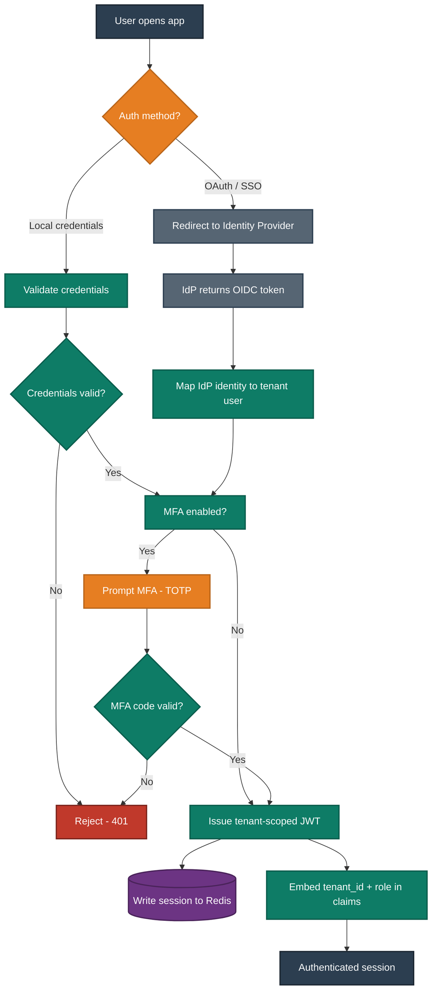

**Workflow — per-request RBAC + tenant guard (runs on every protected endpoint)**

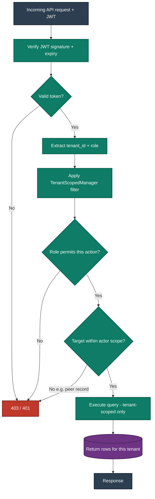

---

## Module 2 — Dashboard

**C4 view:** `Comp_Backend_AllModules` (dashboard composes from all modules)

| Layer | Detail |
|---|---|
| **Sub-modules** | Role-based home · Pending actions · Quick stats |
| **Workflow** | Load → resolve role → assemble role-appropriate widgets → render Admin Hub (desktop) or Engagement Hub (mobile-web) |
| **Core Features (Non-AI)** | Pending approvals count, my goals snapshot, recent feedback, cycle status, quick links |
| **AI Features (Fast)** | Surfaced KPI nudges (from Agent 2); "what changed since you were last here" summary |
| **AI Features (Large)** | None native (consumes outputs of other modules) |
| **Screens** | Admin dashboard, Manager dashboard, Employee dashboard (responsive) |
| **Roles** | All — content differs by role and scope |
| **Integrations** | None directly |
| **Dependencies** | Module 1 (identity), all feature modules |
| **Status** | ✅ MVP |

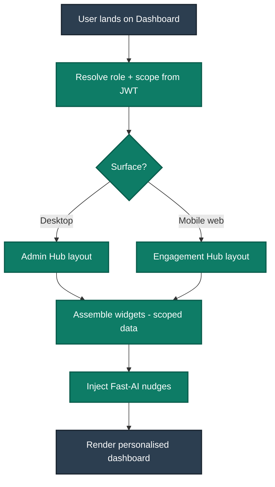

---

## Module 3 — Goals & KPIs (OKR)

**C4 view:** `Comp_Goals`

| Layer | Detail |
|---|---|
| **Sub-modules** | Goal/OKR setting · KPI definition · Scoring engine · Jira sync |
| **Workflow** | Manager sets goals for report → assign KPI weights (**must sum to 100%**) → KPIs track actual values (manual or Jira) → scoring engine computes normalized T/Z scores per cycle |
| **Core Features (Non-AI)** | Goal/OKR CRUD, KPI weight validation (=100%), pre-built KPI templates by role, manual actual-value entry, deterministic T/Z scoring, goal tracking on mobile |
| **AI Features (Fast)** | **Agent 2 — KPI Intelligence**: at-risk nudges, trajectory flags, "critical" alerts |
| **AI Features (Large)** | KPI template suggestion from role + market (advisory); deeper trajectory forecasting ⚠️ Phase 2 |
| **Screens** | Goal list, goal editor, KPI weight editor (live sum indicator), KPI tracker, scoring summary |
| **Roles** | Employee (view own, self-update actuals); Manager (create/approve for reports); HRBP (BU-wide); Admin (config) |
| **Integrations** | **Jira** (pulls `actual_value`) |
| **Dependencies** | Module 1; feeds Reviews, Succession, Career, Analytics |
| **Status** | ✅ MVP |

**Workflow — goal setting + weight validation + scoring**

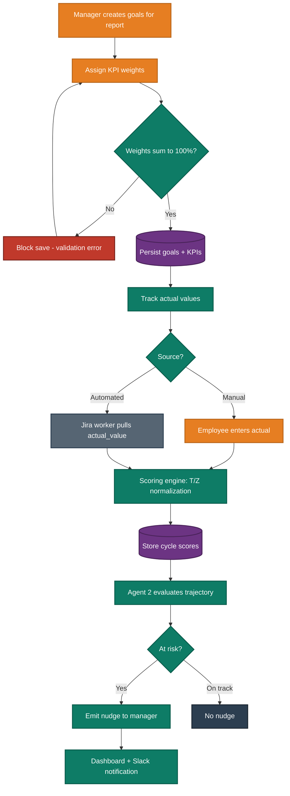

---

## Module 4 — Reviews & Appraisal Cycles

**C4 view:** `Comp_Reviews`

| Layer | Detail |
|---|---|
| **Sub-modules** | Cycle management · Review state machine · AI draft (HITL) · Finalization |
| **Workflow** | Open cycle → Agent 1 drafts review from evidence → draft locked `PENDING_HUMAN_REVIEW` → manager edits → **human approves (HITL)** → route through approval matrix → finalize → audit |
| **Core Features (Non-AI)** | Review cycle CRUD, state machine (Draft → In Review → Approved → Finalized), self/manager/peer/upward assessment capture, cannot-finalize-without-approval rule |
| **AI Features (Fast)** | Inline suggestion / phrasing assist while editing |
| **AI Features (Large)** | **Agent 1 — Review Assistant**: drafts a structured review from KPIs, goals, and feedback with confidence score + citations |
| **Screens** | Cycle setup, review editor (AI draft + edit), approval tracker, finalized review |
| **Roles** | Manager (draft/approve own reports); HRBP (calibration); Employee (view own finalized + self-eval) |
| **Integrations** | None direct (consumes Goals + Feedback) |
| **Dependencies** | Modules 1, 3, 5, 6; AI Orchestration |
| **Status** | ✅ MVP |

**Workflow — review cycle state machine (with HITL)**

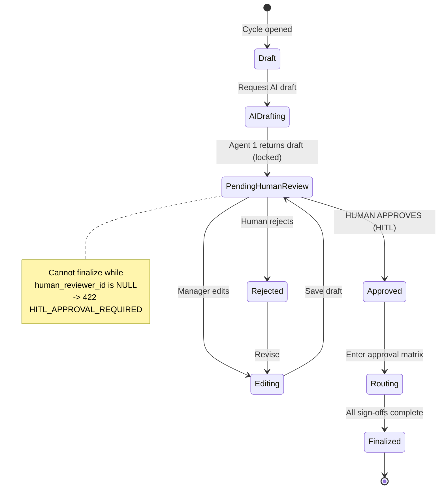

> Agent 1's internal LangGraph node sequence is in **§ AI Agents → Agent 1**.

---

## Module 5 — Feedback (360° + Continuous + 1:1)

**C4 view:** `Comp_Feedback`

| Layer | Detail |
|---|---|
| **Sub-modules** | 360° cycles · Continuous feedback · 1:1 meeting notes · Anonymization · Summarization |
| **Workflow** | Request feedback (self/manager/peer/upward) → collect → **anonymize before any LLM sees it** → Agent 3 summarizes themes → HRBP approves sensitive summaries |
| **Core Features (Non-AI)** | 360 request/collect, continuous feedback (any-time), 1:1 meeting notes, quick mobile 360 assessments, anonymity rules, min-volume threshold |
| **AI Features (Fast)** | Quick feedback prompts / templates; sentiment tag |
| **AI Features (Large)** | **Agent 3 — Feedback Summarization**: anonymized theme extraction (4 sections), anonymity-breach guard |
| **Screens** | Feedback request, give-feedback form, 1:1 notes, feedback summary (HRBP-gated where sensitive) |
| **Roles** | All give/receive; HRBP approves sensitive summaries; identities never exposed cross-peer |
| **Integrations** | **Slack** (prompts/notifications) |
| **Dependencies** | Modules 1, 3; AI Orchestration |
| **Status** | ✅ MVP |

**Workflow — 360 + anonymization + summarization**

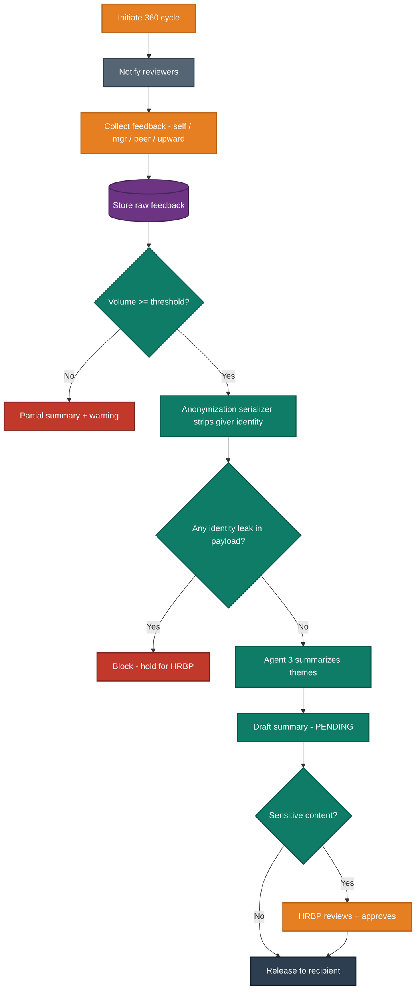

---

## Module 6 — Approval Workflows (Configurable Matrix)

**C4 view:** `Comp_Approvals`

| Layer | Detail |
|---|---|
| **Sub-modules** | Workflow designer · Sequential routing · Parallel routing · Escalation |
| **Workflow** | An approvable artifact (review, JD, record amendment) enters a configurable route; steps run **sequentially** (one after another) or **in parallel** (all at once); escalation on timeout |
| **Core Features (Non-AI)** | Configurable approval matrix, sequential sign-off, parallel sign-off, role/named approvers, timeout escalation, full audit of each decision |
| **AI Features (Fast)** | Suggested next approver; "this looks like prior approved item" hint |
| **AI Features (Large)** | None (deliberately deterministic — approvals must be auditable) |
| **Screens** | Workflow designer (admin), approval inbox, route tracker, escalation view |
| **Roles** | Admin/HRBP configure; Managers/HRBP approve; everyone sees status of their items |
| **Integrations** | Slack notifications |
| **Dependencies** | Modules 1, 4, 7, 14 |
| **Status** | ✅ MVP |

> Both routing diagrams are in **§ Approval Matrix**.

---

## Module 7 — JD Library & AI JD Generator

**C4 view:** `Comp_JD`

| Layer | Detail |
|---|---|
| **Sub-modules** | JD library (CRUD/versioning) · AI generation · Approval routing |
| **Workflow** | HRBP enters role inputs → **JD Generator (Large AI)** produces formatted draft → human edits → route through approval matrix → publish to library |
| **Core Features (Non-AI)** | Centralized JD library, versioning, templates, search, export |
| **AI Features (Fast)** | Inline rewrite / tone adjust; field auto-fill suggestions |
| **AI Features (Large)** | **JD Generator**: produces a professionally formatted JD from structured inputs (title, level, responsibilities, must-haves) via the LLM gateway |
| **Screens** | JD library list, JD input form, AI draft + edit, version history |
| **Roles** | HRBP/Admin generate & manage; Managers request |
| **Integrations** | LLM Providers (via gateway, server-side, PII-aware) |
| **Dependencies** | Modules 1, 6; AI Orchestration; LLM gateway |
| **Status** | ✅ MVP |

> JD generation node sequence is in **§ AI Agents → JD Generator**.

---

## Module 8 — Live Org Chart

**C4 view:** `Comp_OrgChart`

| Layer | Detail |
|---|---|
| **Sub-modules** | Hierarchy render · Vacancy tracking · Headcount |
| **Workflow** | Read reporting-line graph → render interactive hierarchy → reflect live headcount + vacancies → drill into a person |
| **Core Features (Non-AI)** | Real-time interactive org chart, reporting lines, headcount rollups, vacancy markers, search, export |
| **AI Features (Fast)** | "Who reports to X?" natural-language lookup (via chat) |
| **AI Features (Large)** | Structural insight (span-of-control flags) ⚠️ Phase 2 |
| **Screens** | Org chart canvas, person card, vacancy view |
| **Roles** | All view (scoped — managers see their line; HRBP/Admin see BU/tenant) |
| **Integrations** | None (built from identity org-tree) |
| **Dependencies** | Module 1 (org tree) |
| **Status** | ✅ MVP |

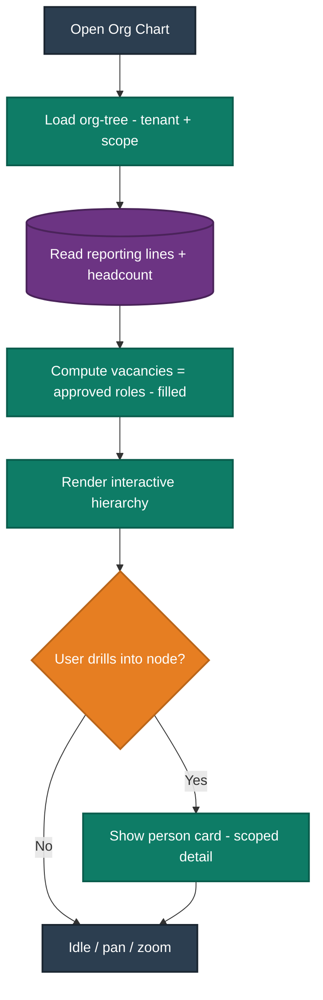

---

## Module 9 — Succession & Talent

**C4 view:** `Comp_Succession`

| Layer | Detail |
|---|---|
| **Sub-modules** | Critical-role registry · Bench · Readiness scoring · Risk flags |
| **Workflow** | Mark critical roles → **Agent 4** scores bench readiness **from internal PMS data** (scores, goals, 360) → rank candidates → flag inadequate coverage → HRBP reviews |
| **Core Features (Non-AI)** | Critical-role registry, bench entries, readiness display, knowledge-risk flags, 9-box placement |
| **AI Features (Fast)** | "Who is ready now for role X?" lookup |
| **AI Features (Large)** | **Agent 4 — Successor Planning**: readiness scoring + ranking + red-flag detection on internal data (no external export required) |
| **Screens** | Succession dashboard, bench list, readiness detail, 9-box grid |
| **Roles** | HRBP/Admin (full); Manager (own report tier only) |
| **Integrations** | None for MVP (Workday/SAP import ⚠️ Phase 2) |
| **Dependencies** | Modules 1, 3, 5; AI Orchestration |
| **Status** | ✅ MVP (**full, on internal data** — confirmed) |

> Agent 4 node sequence is in **§ AI Agents → Agent 4**.

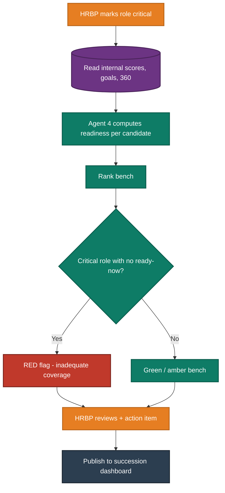

---

## Module 10 — Career Development (Roadmap LITE)

**C4 view:** `Comp_Career`

| Layer | Detail |
|---|---|
| **Sub-modules** | Roadmap generation · Skill-gap view |
| **Workflow** | Read employee scores + goal history + target-role profile → **Roadmap LITE** computes gap-to-next-level → advisory path surfaced to employee + manager |
| **Core Features (Non-AI)** | Target-role selection, skill-gap display, progress tracking |
| **AI Features (Fast)** | "What should I focus on next?" suggestion |
| **AI Features (Large)** | **Career Roadmap LITE**: tiered development path from internal performance signals (advisory — never an auto-promotion) |
| **Screens** | My Growth (roadmap), skill-gap detail |
| **Roles** | Employee (own); Manager (reports); HRBP (BU) |
| **Integrations** | None |
| **Dependencies** | Modules 1, 3; reuses Succession readiness math; AI Orchestration |
| **Status** | ✅ MVP (LITE — full engine ⚠️ Phase 2) |

> Roadmap node sequence is in **§ AI Agents → Career Roadmap LITE**.

---

## Module 11 — AI Assistant (Chat, read-only)

**C4 view:** `Comp_AI_AllAgents`

| Layer | Detail |
|---|---|
| **Sub-modules** | NL query · Intent → RBAC-checked API · Response render |
| **Workflow** | User asks in natural language → interpret intent → translate to **RBAC-checked, tenant-scoped** API call → return answer (read-only). Approvals via chat ⚠️ Phase 2 |
| **Core Features (Non-AI)** | Chat surface (desktop + mobile-web), conversation history |
| **AI Features (Fast)** | **Chat Assistant**: NL lookups — "show me Priya's Q2 goals", "what's pending for my team" — always within caller permissions |
| **AI Features (Large)** | Multi-step reasoning over data ⚠️ Phase 2 |
| **Screens** | Chat panel (both surfaces) |
| **Roles** | All — **inherits caller's exact permissions; can never surface data the user couldn't already see** |
| **Integrations** | LLM gateway |
| **Dependencies** | Modules 1, 3, 4, 5, 8; AI Orchestration |
| **Status** | ✅ MVP (read-only) |

> Chat node sequence is in **§ AI Agents → Chat Assistant**.

---

## Module 12 — Analytics & Reporting

**C4 view:** `Comp_Analytics`

| Layer | Detail |
|---|---|
| **Sub-modules** | Individual analytics · Department analytics · Calibration support |
| **Workflow** | Aggregate scores/feedback at individual and cohort level → enforce **min-cohort privacy** → render dashboards |
| **Core Features (Non-AI)** | Individual performance analytics, department rollups, 9-box calibration data, min-cohort suppression (small teams can't be de-anonymized), export |
| **AI Features (Fast)** | At-risk population rollup; anomaly highlight |
| **AI Features (Large)** | Department-health narrative ⚠️ Phase 2 |
| **Screens** | Individual analytics, department dashboard, calibration grid |
| **Roles** | Manager (reporting line); HRBP (BU-wide); Admin (tenant) |
| **Integrations** | None |
| **Dependencies** | Modules 3, 5 |
| **Status** | ✅ MVP |

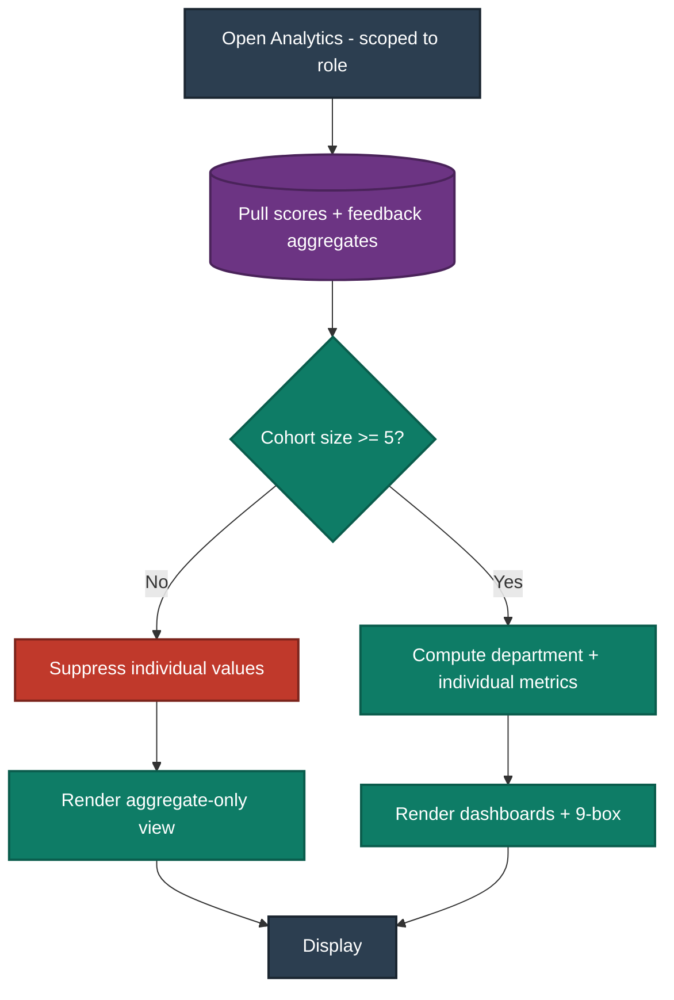

---

## Module 13 — Admin & Billing

**C4 view:** `Comp_AdminBilling`

| Layer | Detail |
|---|---|
| **Sub-modules** | Tenant config · Users & roles · Entitlements · Per-seat billing |
| **Workflow** | Admin manages tenant/users/roles → entitlements stored per tenant → **AI upgrade switch**: buy "Full AI" pack → flip entitlement flags → locked agents appear instantly, no headcount change |
| **Core Features (Non-AI)** | Tenant settings, user/role management, **per-seat count**, **per-feature-pack entitlements (decoupled)**, feature flags at API + UI, in-app upgrade prompts |
| **AI Features (Fast)** | "Which packs would help this tenant?" suggestion (advisory) |
| **AI Features (Large)** | None |
| **Screens** | Tenant config, user/role admin, billing & entitlements, upgrade modal |
| **Roles** | Admin only |
| **Integrations** | Live payment gateway ⚠️ Phase 2 (entitlement logic demoable without it) |
| **Dependencies** | Module 1 |
| **Status** | ✅ MVP |

**Workflow — AI feature upgrade (the demoable commercial switch)**

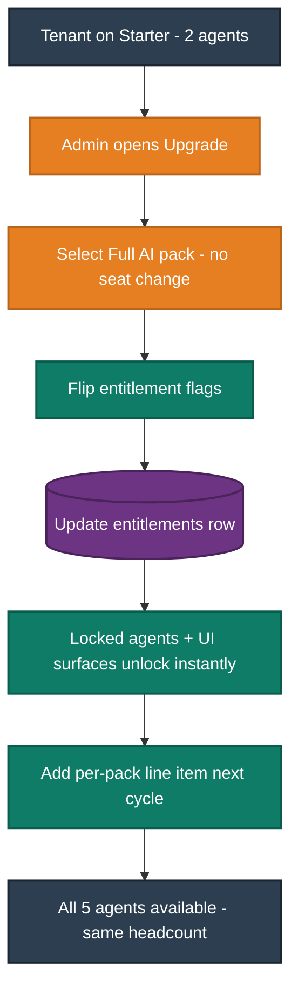

---

## Module 14 — Audit Log

**C4 view:** `Comp_Identity` (audit component shown alongside)

| Layer | Detail |
|---|---|
| **Sub-modules** | Append-only writer · Audit console |
| **Workflow** | Every AI action + every approval writes an immutable record **before** the action takes effect → HRBP/Admin can read but never alter |
| **Core Features (Non-AI)** | Append-only log (DB grant: `INSERT`/`SELECT` only), searchable console, justification capture for private-data access |
| **AI Features (Fast)** | None |
| **AI Features (Large)** | None |
| **Screens** | Audit console (filter by actor/action/date) |
| **Roles** | HRBP (scoped read), Admin (read); **nobody can update/delete** |
| **Integrations** | None |
| **Dependencies** | Module 1; written-to by every AI/approval flow |
| **Status** | ✅ MVP |

---

# PART B — AI AGENTS (each with its own flowchart + HITL gate)

All agents are LangGraph graphs orchestrated through the LLM abstraction gateway (provider-agnostic: Claude / GPT / home-grown MLM). Every consequential output is locked `PENDING_HUMAN_REVIEW` and audited before approval.

| Agent | Bucket | Module | Status |
|---|---|---|---|
| Agent 1 — Review Assistant | **Large AI** | Reviews | ✅ MVP |
| Agent 2 — KPI Intelligence | **Fast AI** | Goals & KPI | ✅ MVP |
| Agent 3 — Feedback Summarization | **Large AI** | Feedback | ✅ MVP |
| Agent 4 — Successor Planning | **Large AI** | Succession | ✅ MVP |
| JD Generator | **Large AI** | JD Library | ✅ MVP |
| Career Roadmap LITE | **Large AI** | Career Dev | ✅ MVP |
| Chat Assistant | **Fast AI** | AI Assistant | ✅ MVP (read-only) |
| Agent 5 — Org Network Analysis | **Large AI** | Network | ⚠️ Phase 2 |

---

### Agent 1 — Review Assistant (Large AI) — LangGraph nodes + HITL

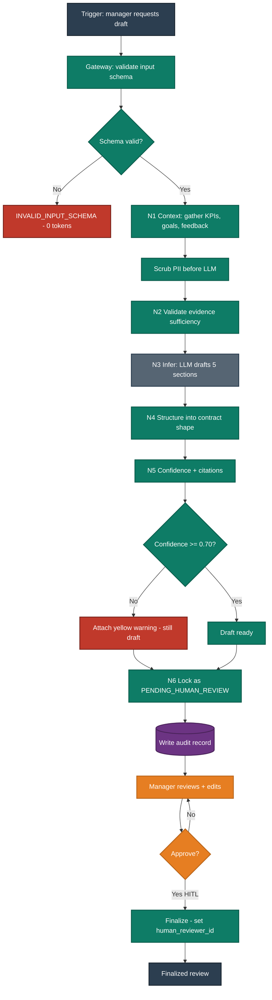

---

### Agent 2 — KPI Intelligence (Fast AI) — nudge flow

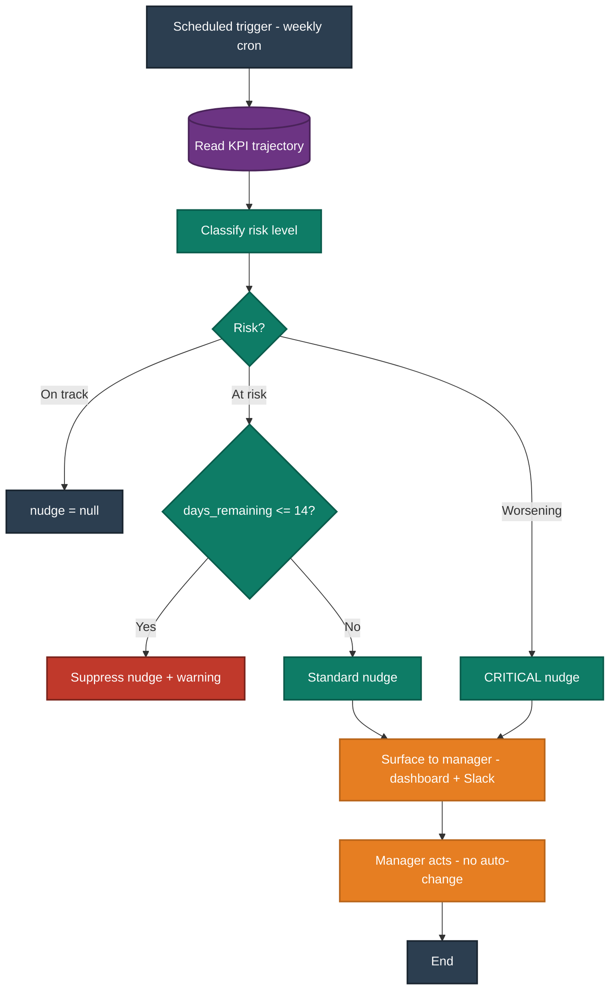

---

### Agent 3 — Feedback Summarization (Large AI) — anonymity-guarded

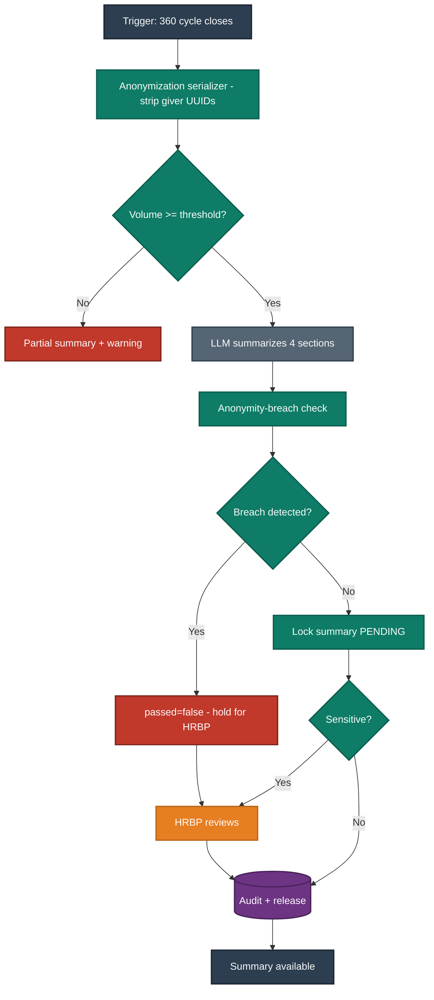

---

### Agent 4 — Successor Planning (Large AI) — internal data only

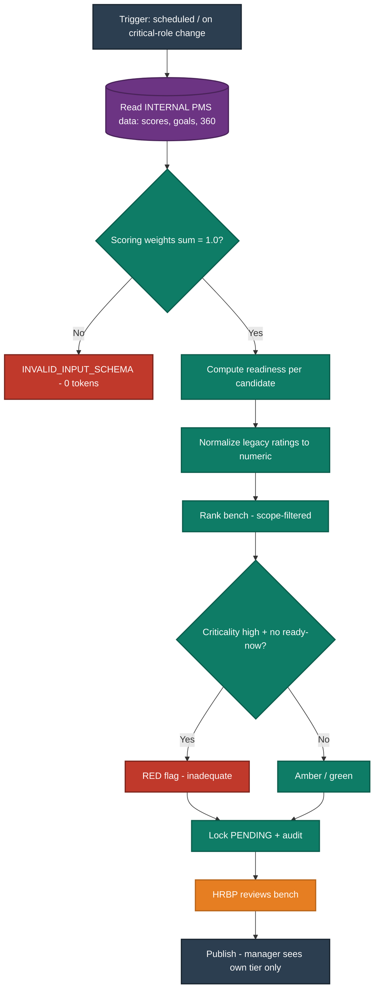

---

### JD Generator (Large AI) — generation + approval

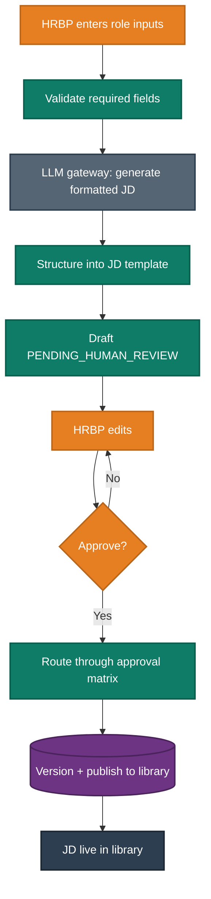

---

### Career Roadmap LITE (Large AI)

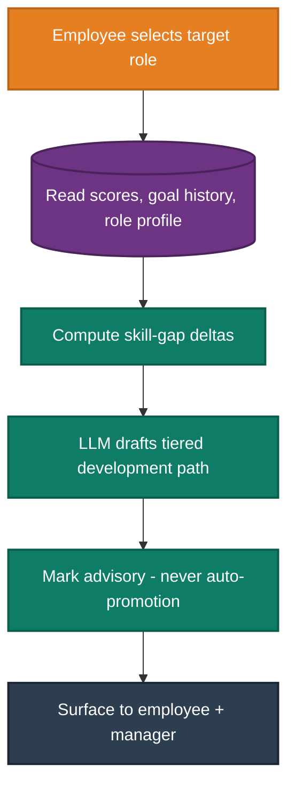

---

### Chat Assistant (Fast AI) — read-only, permission-bound

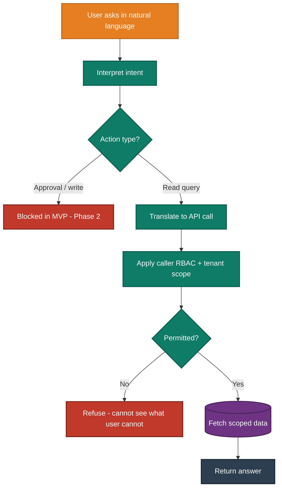

---

# PART C — Approval Matrix Routing

The same engine drives reviews, JDs, and record amendments. Two routing modes, both fully audited.

### Sequential routing (one approver after another)

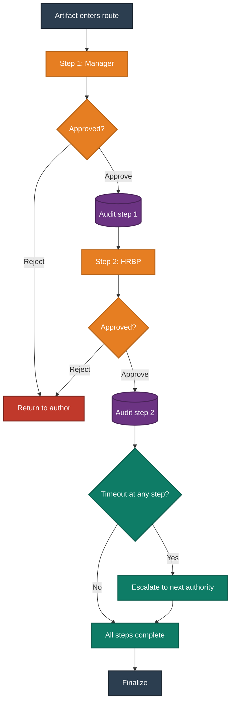

### Parallel routing (all approvers at once)

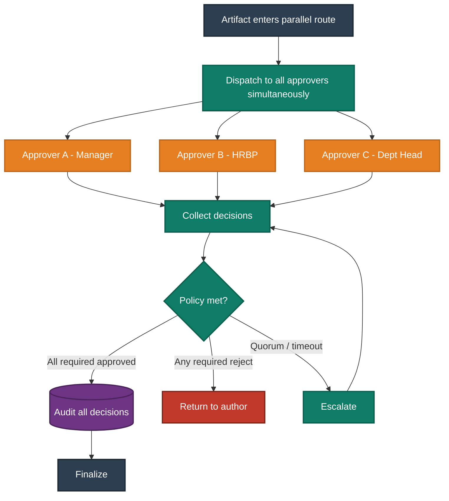

---

# PART D — MVP vs Phase 2 Summary

| Item | Status | Reason (CEO-proof) |
|---|---|---|
| Multi-tenancy, RBAC, JWT, OAuth, MFA | ✅ MVP | Foundation; trust boundary |
| Goals/KPI + scoring | ✅ MVP | Core engine |
| Reviews + HITL + audit | ✅ MVP | Core + commercial trust feature |
| 360 / continuous / 1:1 feedback | ✅ MVP | Core + brief requirement |
| Approval matrix (seq + parallel) | ✅ MVP | Explicit brief requirement |
| JD Generator | ✅ MVP | Explicit brief requirement |
| Live Org Chart | ✅ MVP | Explicit brief requirement |
| Agents 1–4 + Roadmap LITE + read-only Chat | ✅ MVP | The AI commercial moat |
| Succession (internal data) | ✅ MVP | Runs on internally generated data; no external export needed |
| Dual-experience responsive web | ✅ MVP | Brief specifies responsive web, not native |
| Entitlements + per-seat + upgrade switch | ✅ MVP | Commercial pitch; demoable |
| SAML SSO | ⚠️ Phase 2 | OAuth covers MVP; SAML is per-enterprise vendor config |
| Native mobile app (Expo) | ⚠️ Phase 2 | Brief specifies responsive web for MVP; native is a future channel |
| Agent 5 — Org Network Analysis | ⚠️ Phase 2 | Centrality is meaningless until feedback-relationship density accrues from live use |
| Compensation benchmarking (live) | ⚠️ Phase 2 | Depends on a licensed external salary feed — procurement, not engineering |
| Workday/SAP historical import | ⚠️ Phase 2 | Migration convenience; engine already runs on internal data |
| Live payment capture | ⚠️ Phase 2 | PCI vendor setup; entitlement logic is demoable without it |
| Annual third-party pen test | Post-handoff | Sanjay's domain per brief |

---

*End of Document 2. Diagrams are copy-paste ready: paste the single Structurizr workspace (§4) once and export each view; paste each Mermaid block individually. Colours are consistent across all diagrams per the legend in §0.*
