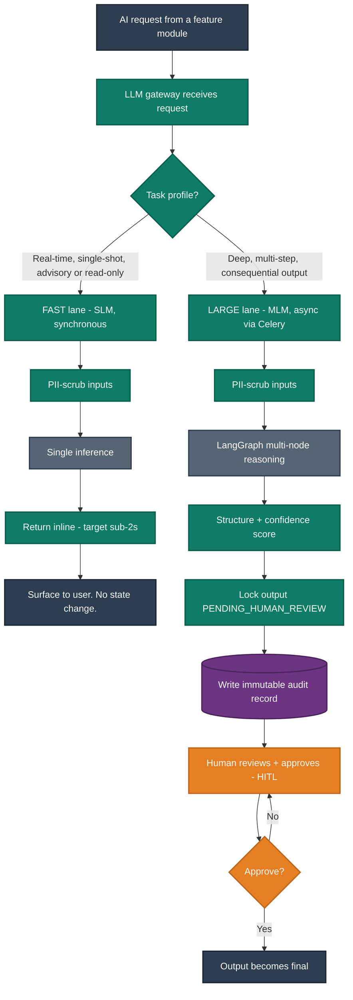
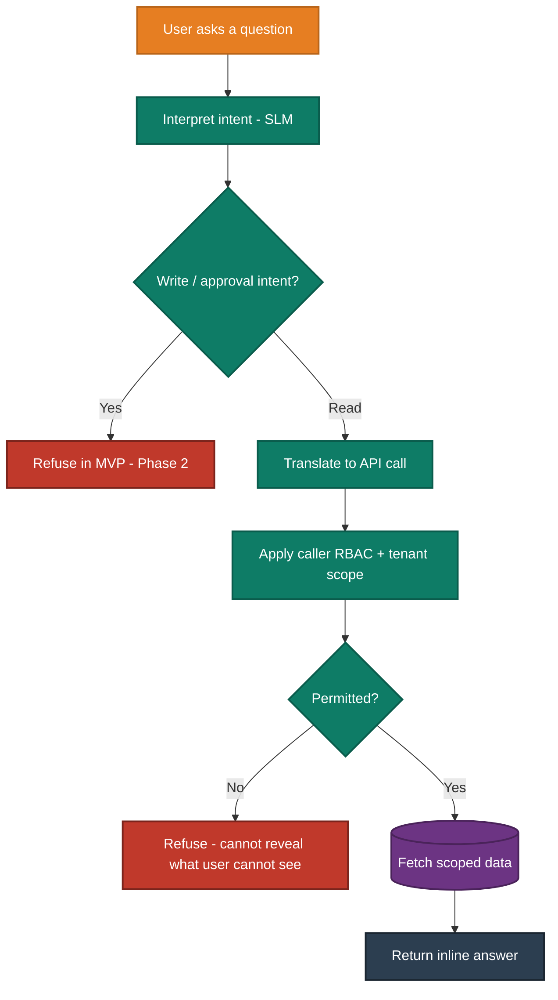
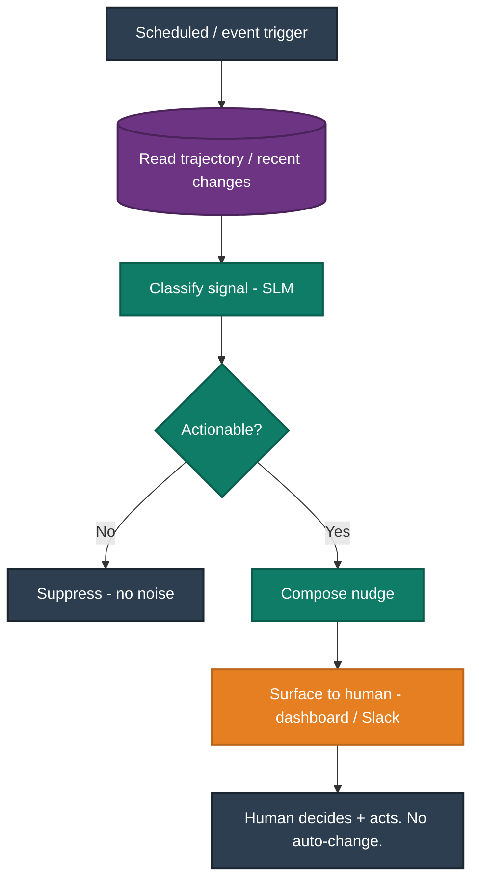
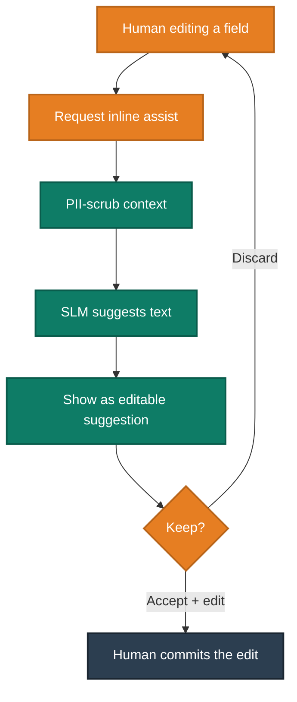
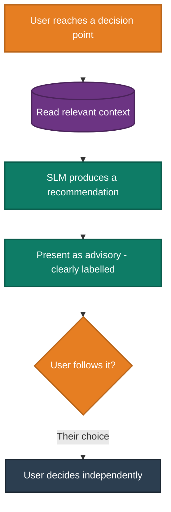
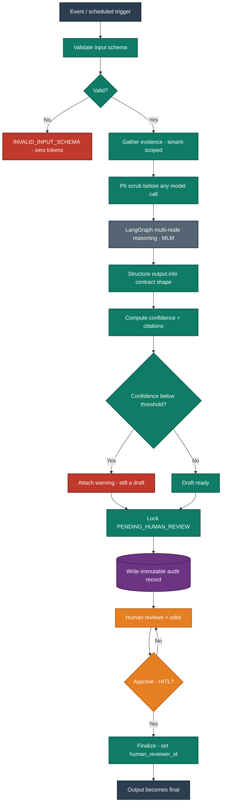
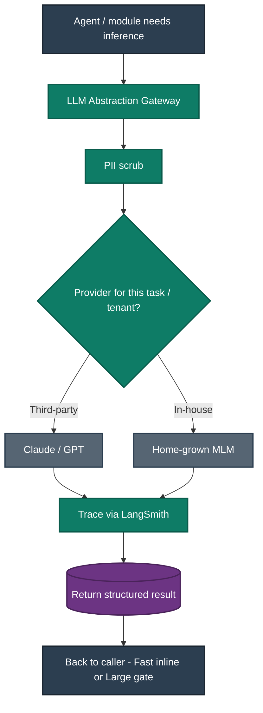

# Document 3 — AI Features (Fast AI vs Large AI)

**Product:** AI-Powered Performance Management System (PMS)
**Company:** Talbotiq · **Bucket Owner / Developer:** Hari K
**Status:** Draft for CEO review · **Scope marker:** ✅ MVP (July 7th handoff) · ⚠️ Phase 2
**Purpose:** This is the standalone AI catalogue. Every AI capability in the platform is listed once and classified strictly as **Fast AI** or **Large AI**. It is the companion to Document 2; the detailed per-agent node sequences live in Document 2, Part B, and are cross-referenced here rather than duplicated.

---

## 0. How to read this document

The platform's AI runs in two lanes. The lane a feature belongs to is a function of its **task profile**, not its importance — a Fast feature is not a lesser feature, it is a different shape of work.

Diagram conventions are identical to Document 2: paste the Structurizr workspace (§2) once and export each view; paste each Mermaid block individually. Colour legend, reproduced for standalone use:

| Mermaid class | Meaning | Colour |
|---|---|---|
| `autoNode` | Automated / system / AI step | Teal `#0E7C66` |
| `humanNode` | Human decision / approval (HITL) | Orange `#E67E22` |
| `dataNode` | Datastore / persistence | Purple `#6C3483` |
| `termNode` | Start / end terminal | Navy `#2C3E50` |
| `errNode` | Error / reject path | Red `#C0392B` |
| `extNode` | External model call | Slate `#566573` |

The governing rule: teal is the machine acting; orange is a human deciding. Every Large-AI output crosses an orange node before it becomes real.

---

## 1. The Fast vs Large Framework

The split is defined by five observable properties. A feature is **Fast** when it is real-time and advisory; it is **Large** when it is deep, consequential, and must be governed by a human gate.

| Property | Fast AI | Large AI |
|---|---|---|
| **Purpose** | Real-time assistance, automation, quick recommendations, quick actions | Deep analysis, multi-step reasoning, document intelligence, forecasting, advanced agent workflows |
| **Execution** | Synchronous, in-request | Asynchronous (Celery worker), event-triggered |
| **Latency target** | Sub-second to ~2s, inline | Seconds to minutes; backgrounded |
| **Model class** | Small / fast model (SLM-routed) | Larger model (MLM) via the LLM gateway |
| **Consequence & HITL** | Advisory or read-only; **no state change without a human acting on it anyway** | Produces a consequential artifact; **locked `PENDING_HUMAN_REVIEW`, HITL-gated, audited** |

Two consequences fall out of this and hold across the whole platform:

- A Fast feature can never *commit* a consequential change on its own. The most a Fast feature does is surface information or a suggestion; a human still acts. (The MVP chat assistant is read-only for exactly this reason.)
- Every Large feature shares the same safeguard pipeline (§5): PII scrub, schema validation, structured output, confidence scoring, HITL gate, immutable audit.

---

## 2. AI Architecture — C4 Model (Structurizr DSL)

This workspace shows the AI subsystem specifically: how a request from any feature module is routed by the LLM gateway into the Fast lane or the Large lane, and how the Large lane is forced through the HITL and audit gate before anything becomes final.

```structurizr
workspace "PMS AI" "AI Feature Architecture - Fast vs Large" {
    !identifiers hierarchical

    model {
        user = person "User" "Employee, Manager, HRBP or Admin. AI runs within the caller's permissions."

        pms = softwareSystem "PMS Platform" "AI-powered performance management." {
            spa = container "Web Application" "Surfaces AI inline (Fast) and as review queues (Large)." "React, TypeScript" "WebTier"

            api = container "Backend API" "Hosts feature modules and the AI control plane." "Python, Django REST Framework" "Service" {
                modules = component "Feature Modules" "Goals, Reviews, Feedback, JD, Org Chart, Succession, Career, Chat, Admin."
                router  = component "AI Router" "Classifies each request as Fast or Large by task profile."
                llmgw   = component "LLM Abstraction Gateway" "Provider-agnostic interface. PII scrub. Switchable across providers." 
                hitl    = component "HITL + Audit Gate" "Locks Large outputs PENDING_HUMAN_REVIEW and writes immutable audit before finalize."
            }

            worker = container "Async Workers" "Runs Large-AI graphs and scheduled scoring off the request path." "Python, Celery" "Service"

            aiorch = container "AI Orchestration" "Stateful agent graphs with trace observability." "Python, LangGraph, LangSmith" "AI" {
                fastLane  = component "Fast AI Lane" "SLM-routed, synchronous, advisory or read-only."
                largeLane = component "Large AI Lane" "MLM, multi-node graphs, HITL-gated, async."
            }

            db  = container "Relational Database" "System of record + immutable audit log." "MySQL 8" "Database"
            bus = container "Event Bus" "Durable agent-trigger events for Large lane." "Apache Kafka" "Database"
        }

        llm = softwareSystem "LLM Providers" "Third-party (Claude / GPT) and home-grown MLM. Provider-agnostic." "External"

        // UI and module flow
        user -> pms.spa "Asks, drafts, approves" "HTTPS"
        pms.spa -> pms.api "Calls" "JSON/HTTPS, tenant-scoped JWT"
        pms.api.modules -> pms.api.router "Submits AI request"
        pms.api.router -> pms.api.llmgw "Routes Fast or Large"

        // Fast lane: synchronous, inline
        pms.api.llmgw -> pms.aiorch.fastLane "Fast: synchronous SLM call"
        pms.aiorch.fastLane -> llm "Inference (PII-scrubbed)" "HTTPS"

        // Large lane: async, gated
        pms.api.router -> pms.bus "Emits trigger for Large tasks"
        pms.bus -> pms.worker "Consumes trigger"
        pms.worker -> pms.aiorch.largeLane "Runs multi-node graph"
        pms.aiorch.largeLane -> pms.api.llmgw "MLM calls"
        pms.aiorch.largeLane -> pms.api.hitl "Submits locked output"
        pms.api.hitl -> pms.db "Writes PENDING + audit"
        user -> pms.api.hitl "Reviews + approves (HITL)"

        pms.api -> pms.db "Reads/writes (tenant-scoped)" "SQL"
    }

    views {
        container pms "AI_Containers" {
            include *
            autolayout lr
        }

        component pms.api "AI_ControlPlane" {
            include *
            autolayout lr
        }

        component pms.aiorch "AI_Lanes" {
            include *
            autolayout lr
        }

        styles {
            element "Element" {
                shape roundedbox
                color #FFFFFF
            }
            element "Person" {
                shape person
                background #2C3E50
                color #FFFFFF
            }
            element "Software System" {
                background #1B4F72
                color #FFFFFF
            }
            element "Container" {
                background #2471A3
                color #FFFFFF
            }
            element "WebTier" {
                background #2E86C1
                color #FFFFFF
            }
            element "Service" {
                background #1A5276
                color #FFFFFF
            }
            element "Component" {
                background #5499C7
                color #FFFFFF
            }
            element "AI" {
                background #0E7C66
                color #FFFFFF
            }
            element "Database" {
                shape cylinder
                background #6C3483
                color #FFFFFF
            }
            element "External" {
                background #566573
                color #FFFFFF
            }
            element "Boundary" {
                strokeWidth 5
            }
            relationship "Relationship" {
                thickness 4
                color #34495E
            }
        }
    }

    configuration {
        scope softwaresystem
    }
}
```

---

## 3. The Routing Decision (Fast lane vs Large lane)

Every AI request enters the gateway and is classified. This single diagram is the heart of the Fast-vs-Large model.



---

## 4. Fast AI Catalogue

Fast features are real-time and advisory. They collapse into **four interaction patterns**; each Fast feature below is mapped to its pattern, and each pattern has one flowchart. None of them change state on their own.

### Fast AI feature list

| # | Fast AI feature | Module | Pattern | Status |
|---|---|---|---|---|
| F1 | KPI at-risk nudges & "critical" alerts (Agent 2) | Goals & KPI | Proactive Nudge | ✅ MVP |
| F2 | Read-only natural-language lookups ("show me Priya's Q2 goals", "what's pending for my team") | AI Assistant | Read-only Lookup | ✅ MVP |
| F3 | "Who reports to X?" / "who's ready now?" quick queries | Org Chart / Succession | Read-only Lookup | ✅ MVP |
| F4 | Dashboard "what changed since last visit" + surfaced nudges | Dashboard | Proactive Nudge | ✅ MVP |
| F5 | Inline review phrasing / rewrite assist while editing | Reviews | Inline Assist | ✅ MVP |
| F6 | JD inline rewrite / tone adjust | JD Library | Inline Assist | ✅ MVP |
| F7 | Quick feedback prompts / templates / sentiment tag | Feedback | Inline Assist | ✅ MVP |
| F8 | Smart KPI template defaults / suggestion | Goals & KPI | Advisory Suggestion | ✅ MVP |
| F9 | Suggested next approver / "looks like prior approved item" hint | Approval Workflows | Advisory Suggestion | ✅ MVP |
| F10 | Recommended feature-pack suggestion for a tenant | Admin & Billing | Advisory Suggestion | ✅ MVP |

### Pattern 1 — Read-only Lookup (F2, F3)

Natural-language question answered strictly within the caller's permissions. Cannot write.



### Pattern 2 — Proactive Nudge (F1, F4)

Scheduled or event-driven signal surfaced to a human. Never auto-acts.



### Pattern 3 — Inline Assist (F5, F6, F7)

Suggests text while a human is actively editing. The human keeps or discards it.



### Pattern 4 — Advisory Suggestion (F8, F9, F10)

A recommendation attached to a decision point. Purely advisory.



---

## 5. Large AI Catalogue

Large features are deep, consequential, and run off the request path. Every one is governed by the **same shared safeguard pipeline** below, then cross-references its detailed LangGraph node sequence in Document 2, Part B.

### Shared Large-AI safeguard pipeline (applies to every Large feature)



### Large AI feature list

| # | Large AI feature | Module | Doc 2 reference | Status |
|---|---|---|---|---|
| L1 | **Review Assistant** — drafts a structured review from KPIs, goals and feedback with confidence + citations (Agent 1) | Reviews | Doc 2, Part B → Agent 1 | ✅ MVP |
| L2 | **Feedback Summarization** — anonymized theme extraction with anonymity-breach guard (Agent 3) | Feedback | Doc 2, Part B → Agent 3 | ✅ MVP |
| L3 | **Successor Planning** — readiness scoring + ranking + red-flag detection on internal PMS data (Agent 4) | Succession | Doc 2, Part B → Agent 4 | ✅ MVP |
| L4 | **JD Generator** — professionally formatted job descriptions from structured inputs | JD Library | Doc 2, Part B → JD Generator | ✅ MVP |
| L5 | **Career Roadmap LITE** — tiered gap-to-next-level development path (advisory) | Career Development | Doc 2, Part B → Career Roadmap LITE | ✅ MVP |
| L6 | **KPI trajectory forecasting** — deep multi-cycle projection beyond the Fast nudge | Goals & KPI | new in Phase 2 | ⚠️ Phase 2 |
| L7 | **Organizational Network Analysis** — centrality / influence / brokerage scoring (Agent 5) | Network | Doc 2 §1 (Phase 2) | ⚠️ Phase 2 |
| L8 | **Compensation & role benchmarking** — percentile positioning + band/title recommendations | Compensation | requires licensed external feed | ⚠️ Phase 2 |
| L9 | **Salary-hike & promotion recommendations** — combines performance, readiness and market gap | Compensation | depends on L8 feed | ⚠️ Phase 2 |
| L10 | **Department-health narrative** — written analysis over department aggregates | Analytics | new in Phase 2 | ⚠️ Phase 2 |
| L11 | **Legacy-document intelligence** — parses Workday/SAP exports for historical import | Historical Import | new in Phase 2 | ⚠️ Phase 2 |
| L12 | **Multi-step chat reasoning + chat-driven approvals** — beyond read-only lookups | AI Assistant | extends Module 11 | ⚠️ Phase 2 |

Every MVP Large feature (L1–L5) inherits the safeguard pipeline above; their individual node graphs are already specified and approved in Document 2.

---

## 6. LLM Abstraction & Providers

A hard requirement from the official brief: AI calls are **server-side** and routed through a provider-agnostic gateway. OpenAI is not hardcoded.

| Aspect | Approach |
|---|---|
| **Interface** | A thin gateway exposing `generate()` and `embed()`. No module or agent calls a provider SDK directly. |
| **Providers** | Third-party (Claude / GPT) and the company's **home-grown MLM**, selectable per task or per tenant via configuration. |
| **Fast vs Large routing** | The gateway routes Fast tasks to a small/fast model and Large tasks to a larger model; provider choice is config, not code. |
| **Safety on every call** | Server-side only; PII scrubbed before egress; full trace observability (latency, tokens, confidence) via LangSmith. |
| **Fallback** | If the enterprise/zero-retention key is unavailable, the gateway falls back to a standard key plus PII-scrubbing, so the AI lanes are never blocked. Flagged as a launch caveat, not a stoppage. |



---

## 7. Fast vs Large — Master Summary

| | Fast AI | Large AI |
|---|---|---|
| **MVP features** | F1–F10 (all ✅ MVP) | L1–L5 (✅ MVP) |
| **Phase 2 features** | — | L6–L12 (⚠️ Phase 2) |
| **Execution** | Synchronous, inline | Async, event-triggered |
| **Human gate** | Advisory / read-only by design | HITL-gated and audited |
| **Model** | Small / fast (SLM) | Larger (MLM) |
| **Commercial role** | Everyday stickiness — the assistant that is always present | The headline moat — the work the platform does for you |

---

## 8. MVP vs Phase 2 — AI Scope

| AI feature | Status | CEO-proof reason |
|---|---|---|
| Fast AI F1–F10 | ✅ MVP | Lightweight, synchronous, advisory; high daily value at low build cost |
| Review Assistant (L1) | ✅ MVP | The headline AI feature |
| Feedback Summarization (L2) | ✅ MVP | Reuses the anonymization layer L1 needs |
| Successor Planning (L3) | ✅ MVP | Runs on internally generated data; no external export required |
| JD Generator (L4) | ✅ MVP | Explicit brief requirement |
| Career Roadmap LITE (L5) | ✅ MVP | Reuses readiness/skill-gap math |
| KPI trajectory forecasting (L6) | ⚠️ Phase 2 | Deep forecasting beyond the Fast nudge; additive, not core to the demo |
| Org Network Analysis (L7) | ⚠️ Phase 2 | Centrality is meaningless until feedback-relationship density accrues from live use |
| Compensation benchmarking (L8) | ⚠️ Phase 2 | Depends on a licensed external salary feed — procurement, not engineering |
| Salary-hike / promotion recommendations (L9) | ⚠️ Phase 2 | Depends on the L8 market feed |
| Department-health narrative (L10) | ⚠️ Phase 2 | Additive analytics layer; not core to the demo loop |
| Legacy-document intelligence (L11) | ⚠️ Phase 2 | Migration convenience; engine already runs on internal data |
| Multi-step chat reasoning + chat approvals (L12) | ⚠️ Phase 2 | MVP chat is read-only; approvals via chat add write-path risk that needs its own hardening |

---

*End of Document 3. All diagrams are copy-paste ready and use the colour system shared with Document 2. Detailed per-agent node sequences are in Document 2, Part B, and are referenced rather than duplicated here.*
